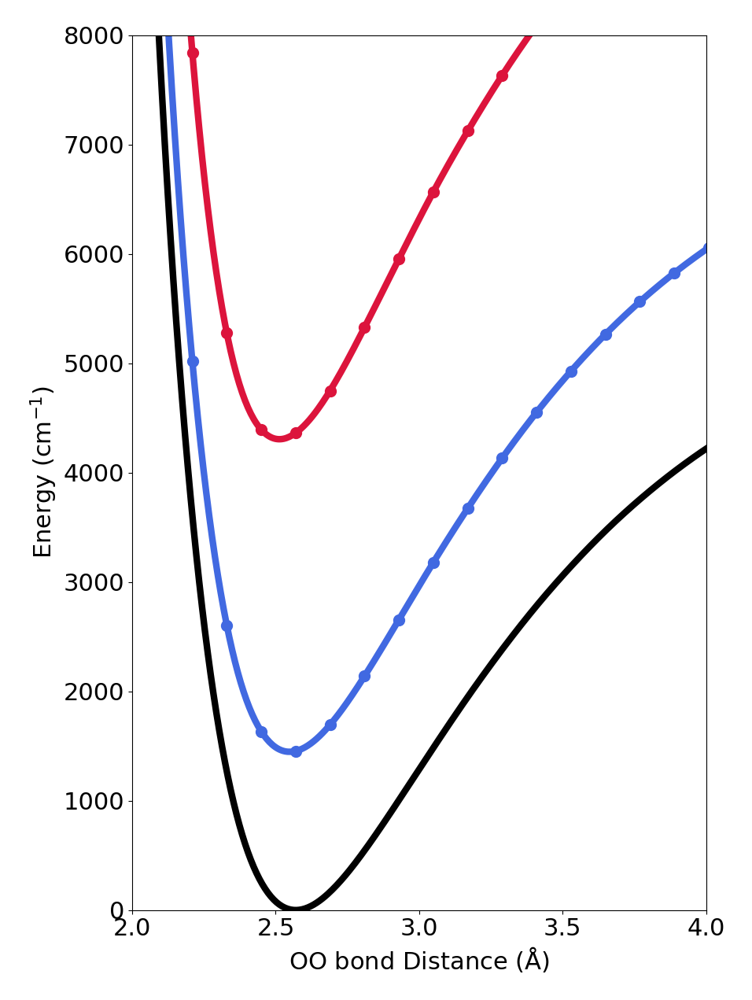
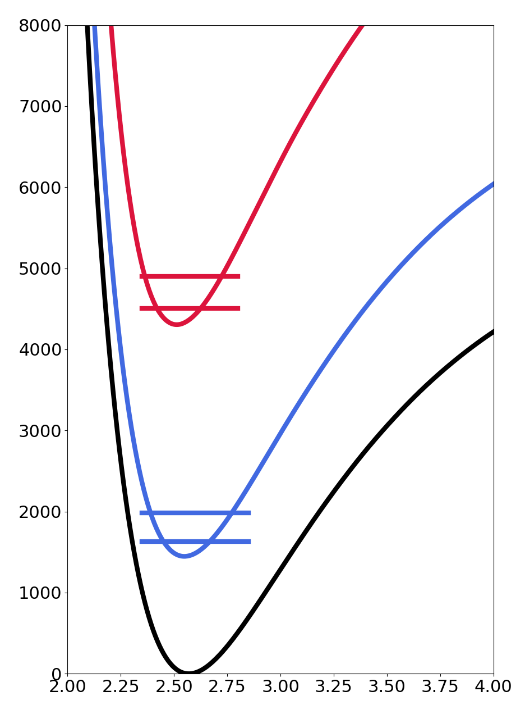

<a id="adiabatic-potentials" style="width:0;height:0;margin:0;padding:0;">&zwnj;</a>

# Adiabatic Potentials
Why this is useful:
* We can model the effects a lower frequency molecular stretch has on a higher frequency molecular motion. 
* We can calculate overlaps between the various levels of excitation to create [Franck-Condon Progressions](https://chem.libretexts.org/Bookshelves/Physical_and_Theoretical_Chemistry_Textbook_Maps/Map%3A_Physical_Chemistry_(McQuarrie_and_Simon)/13%3A_Molecular_Spectroscopy/13-07._The_Franck-Condon_Principle_Predicts_the_Relative_Intensities_of_Vibronic_Transitions#Franck-Condon_Progressions).
* We can see shifts in energy minimas based on quanta of excitation.
* It is a way to visualize the effects of anharmonicity on vibrational energy levels. 

## Theory
The easiest way to start thinking about this approximation is by comparing it to the [Born-Oppenheimer Approximation](https://chem.libretexts.org/Bookshelves/Physical_and_Theoretical_Chemistry_Textbook_Maps/Book%3A_Time_Dependent_Quantum_Mechanics_and_Spectroscopy_(Tokmakoff)/5%3A_Adiabatic_Approximation/5.1%3A_Born%E2%80%93Oppenheimer_Approximation).
In this case, instead of nuclear and electronic (as in the BOA) we will be separating electronic and vibrational energies. 
By doing this, we will be able to see changes in frequency dependent on the number of quanta in both degrees of freedom.
This approximation works well when considering two coordinates with about an order of magnitude difference in their frequencies.

Relating this to what we do in the group, an OO stretch in a water cluster is around 300 cm^-1^ where a hydrogen bonded OH stretch is around 2600 cm^-1^.
For one example, in [this paper](https://pubs.acs.org/doi/10.1021/acs.jpca.8b08507) this method was applied to the HD~8~O~4~^+^ system.

## Creating Adiabatic Potentials
You will need a 1D electronic potential energy surface. Most likely this will come from some sort of Gaussian calculation,
see (MORE REFERENCES) or ask someone for details. 
To make a Harmonic approximation, we will use the energy equation from a harmonic oscillator: 
$$ E = \hbar \times \omega (n + \frac 12) $$
where omega is equal to the frequency and n is the number of quanta in the stretch. 
To get the frequency, you can either do normal mode analysis or finite differencing to find a force constant and calculate out
a frequency. Depending on your specific system this method may change, try a few or ask around for what might be best to try.

Once you have a harmonic energy for n = 0, 1, etc.. you simply need to add it on to your electronic potential.
At this point you have adiabatic potentials describing the level of excitation (number of quanta) of your fast motion as a function 
of the slow motion.  
### What this looks like in Python
load in the results of your electronic energy calculation, describe your frequencies, and then calculate and add your energies. Lastly you can 
create your plots! 

In this example I (Rachel) used a finite difference method (See McUtils for more help with this!) on a bunch of scans I did of my slow coordinate 
at every point of my fast coordinate. I like to save my data as an ```OrderedDict``` where the keys are the slow coordinate values and the 
values are two column arrays describing the fast coordinate values and its corresponding energy.

```python
import numpy as np
import matplotlib.pyplot as plt
# Load in data
data = np.loadtxt("myelectronicenergyresults.dat")
x_values = data[:, 0]  # first column of file is the slow motion coordinate values
energies = data[:, 1]  # second column of the file is the electronic energy at the coordinate. 

# Complete a finite difference
from McUtils.Zachary import finite_difference
slow_coord = np.array(list(finite_dict.keys()))  # my slow coordinate is an OO stretch
freqs = np.zeros(len(finite_dict))  # initialize an array to put your frequencies in!
mO = O * amutokg  # make sure to keep track of all your units!
mH = H * amutokg
muOH = ((2 * mO) * mH) / ((2 * mO) + mH)  # here my fast coordinate is the shared proton 
for j, n in enumerate(finite_dict):
    x = finite_dict[n][:, 0] * angtom
    E = finite_dict[n][:, 1] * hartoj
    k = finite_difference(x, E, 2, end_point_precision=0, stencil=5, only_center=True)[0]
    freqs[j] = (np.sqrt(k / muOH))/ hztowave
    
# Calculate the ground state energy (fast coord n=0)
E0 = freqs * 0.5
y_gs = energies + E0
# Calculate the first excited state energy (fast coord n=1)
E1 = freqs * 1.5
y_es = energies + E1

# Create the plots. 
plt.plot(x_values, energies)
plt.plot(x_values, y_gs)
plt.plot(x_values, y_es)
plt.show()
```
Ultimately this should end up looking something like:



## Creating Energy Levels in the Adiabatic Potentials
The simplest way to put energy levels into these potentials is to perform a DVR. See the ```Implementing DVR``` reference for help 
getting you started with this. Note here that your potential energy is function of your slow coordinate so your DVR should be calculating the 
kinetic energy with respect to the slow coordinate. 

Using the energy eigenvalues that come out of the DVR, you are able to know look at what the energy levels inside of the adiabatic potentials look like. 
The energy levels correspond to the number of quanta in the slow coordinate. So if you were looking at the plot below, the first line in the blue curve 
corresponds to the energy with 0 quanta in the slow coordinate and 0 quanta in the fast coordinate, the second is 1 quantum in the slow coordinate and 0 quanta 
in the fast and so on and so forth.  

By rearranging some data and doing a little matplotlib magic, these adiabatic plots should look something like: 



## Next Steps
There are many ways to approach solving this problem, but once you have one that you are comfortable with, you can use all this data to calculate 
intensities and create stick spectra of the progressions. 
