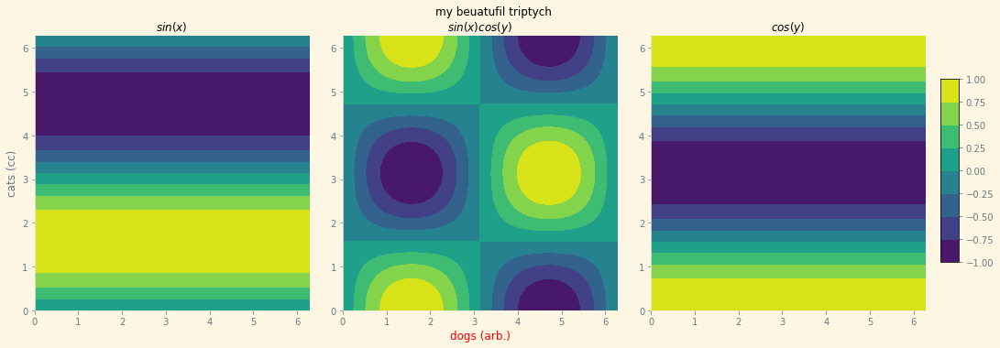

## <a id="McUtils.Plots.Graphics.GraphicsGrid">GraphicsGrid</a>
A class for easily building sophisticated multi-panel figures.
Robustification work still needs to be done, but the core interface is there.
Supports themes & direct, easy access to the panels, among other things.
Builds off of `GraphicsBase`.

### Properties and Methods
```python
default_style: dict
```
<a id="McUtils.Plots.Graphics.GraphicsGrid.__init__" class="docs-object-method">&nbsp;</a>
```python
__init__(self, *args, nrows=2, ncols=2, graphics_class=<class 'McUtils.Plots.Graphics.Graphics'>, figure=None, axes=None, subplot_kw=None, _subplot_init=None, mpl_backend=None, subimage_size=(200, 200), padding=None, spacings=None, **opts): 
```

<a id="McUtils.Plots.Graphics.GraphicsGrid.set_options" class="docs-object-method">&nbsp;</a>
```python
set_options(self, padding=None, spacings=None, background=None, colorbar=None, figure_label=None, **parent_opts): 
```

<a id="McUtils.Plots.Graphics.GraphicsGrid.__iter__" class="docs-object-method">&nbsp;</a>
```python
__iter__(self): 
```

<a id="McUtils.Plots.Graphics.GraphicsGrid.__getitem__" class="docs-object-method">&nbsp;</a>
```python
__getitem__(self, item): 
```

<a id="McUtils.Plots.Graphics.GraphicsGrid.__setitem__" class="docs-object-method">&nbsp;</a>
```python
__setitem__(self, item, val): 
```

<a id="McUtils.Plots.Graphics.GraphicsGrid.__getattr__" class="docs-object-method">&nbsp;</a>
```python
__getattr__(self, item): 
```

<a id="McUtils.Plots.Graphics.GraphicsGrid.calc_image_size" class="docs-object-method">&nbsp;</a>
```python
calc_image_size(self): 
```

<a id="McUtils.Plots.Graphics.GraphicsGrid.image_size" class="docs-object-method">&nbsp;</a>
```python
@property
image_size(self): 
```

<a id="McUtils.Plots.Graphics.GraphicsGrid.figure_label" class="docs-object-method">&nbsp;</a>
```python
@property
figure_label(self): 
```

<a id="McUtils.Plots.Graphics.GraphicsGrid.padding" class="docs-object-method">&nbsp;</a>
```python
@property
padding(self): 
```

<a id="McUtils.Plots.Graphics.GraphicsGrid.padding_left" class="docs-object-method">&nbsp;</a>
```python
@property
padding_left(self): 
```

<a id="McUtils.Plots.Graphics.GraphicsGrid.padding_right" class="docs-object-method">&nbsp;</a>
```python
@property
padding_right(self): 
```

<a id="McUtils.Plots.Graphics.GraphicsGrid.padding_top" class="docs-object-method">&nbsp;</a>
```python
@property
padding_top(self): 
```

<a id="McUtils.Plots.Graphics.GraphicsGrid.padding_bottom" class="docs-object-method">&nbsp;</a>
```python
@property
padding_bottom(self): 
```

<a id="McUtils.Plots.Graphics.GraphicsGrid.spacings" class="docs-object-method">&nbsp;</a>
```python
@property
spacings(self): 
```

<a id="McUtils.Plots.Graphics.GraphicsGrid.background" class="docs-object-method">&nbsp;</a>
```python
@property
background(self): 
```

<a id="McUtils.Plots.Graphics.GraphicsGrid.colorbar" class="docs-object-method">&nbsp;</a>
```python
@property
colorbar(self): 
```

<a id="McUtils.Plots.Graphics.GraphicsGrid.prep_show" class="docs-object-method">&nbsp;</a>
```python
prep_show(self): 
```

<a id="McUtils.Plots.Graphics.GraphicsGrid.show" class="docs-object-method">&nbsp;</a>
```python
show(self, **kwargs): 
```

### Examples
Create a multi-panel figure

<div class="card in-out-block" markdown="1">

```python
grid = np.linspace(0, 2 * np.pi, 100)
grid_2D = np.meshgrid(grid, grid)
x = grid_2D[1]
y = grid_2D[0]

main = GraphicsGrid(ncols=3, nrows=1, theme='Solarize_Light2', figure_label='my beuatufil triptych',
                            padding=((35, 60), (35, 40)), subimage_size=300)
main[0, 0] = ContourPlot(x, y, np.sin(y), plot_label='$sin(x)$',
                         axes_labels=[None, "cats (cc)"],
                         figure=main[0, 0]
                         )
main[0, 1] = ContourPlot(x, y, np.sin(x) * np.cos(y),
                         plot_label='$sin(x)cos(y)$',
                         axes_labels=[Styled("dogs (arb.)", {'color': 'red'}), None],
                         figure=main[0, 1])
main[0, 2] = ContourPlot(x, y, np.cos(y), plot_label='$cos(y)$', figure=main[0, 2])
main.colorbar = {"graphics": main[0, 1].graphics}
```

<div class="card-body out-block" markdown="1">


</div>
</div>

___

[Edit Examples](https://github.com/McCoyGroup/References/edit/gh-pages/Documentation/examples/McUtils/Plots/Graphics/GraphicsGrid.md) or 
[Create New Examples](https://github.com/McCoyGroup/References/new/gh-pages/?filename=Documentation/examples/McUtils/Plots/Graphics/GraphicsGrid.md) <br/>
[Edit Template](https://github.com/McCoyGroup/References/edit/gh-pages/Documentation/templates/McUtils/Plots/Graphics/GraphicsGrid.md) or 
[Create New Template](https://github.com/McCoyGroup/References/new/gh-pages/?filename=Documentation/templates/McUtils/Plots/Graphics/GraphicsGrid.md) <br/>
[Edit Docstrings](https://github.com/McCoyGroup/McUtils/edit/master/Plots/Graphics.py?message=Update%20Docs)