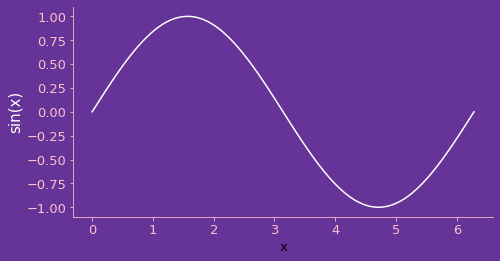

## <a id="McUtils.Plots.Plots.Plot">Plot</a>
The base plotting class to interface into matplotlib or (someday 3D) VTK.
In the future hopefully we'll be able to make a general-purpose `PlottingBackend` class that doesn't need to be `matplotlib` .
Builds off of the `Graphics` class to make a unified and convenient interface to generating plots.
Some sophisticated legwork unfortunately has to be done vis-a-vis tracking constructed lines and other plotting artefacts,
since `matplotlib` is designed to infuriate.

### Properties and Methods
<a id="McUtils.Plots.Plots.Plot.__init__" class="docs-object-method">&nbsp;</a>
```python
__init__(self, *params, method='plot', figure=None, axes=None, subplot_kw=None, plot_style=None, theme=None, **opts): 
```

- `params`: `Any`
    >_empty_ or _x_, _y_ arrays or _function_, _xrange_
- `plot_style`: `dict | None`
    >the plot styling options to be fed into the plot method
- `method`: `str`
    >the method name as a string
- `figure`: `Graphics | None`
    >the Graphics object on which to plot (None means make a new one)
- `axes`: `None`
    >the axes on which to plot (used in constructing a Graphics, None means make a new one)
- `subplot_kw`: `dict | None`
    >the keywords to pass on when initializing the plot
- `colorbar`: `None | bool | dict`
    >whether to use a colorbar or what options to pass to the colorbar
- `opts`: `Any`
    >options to be fed in when initializing the Graphics

<a id="McUtils.Plots.Plots.Plot.plot" class="docs-object-method">&nbsp;</a>
```python
plot(self, *params, **plot_style): 
```
Plots a set of data & stores the result
- `:returns`: `_`
    >the graphics that matplotlib made

<a id="McUtils.Plots.Plots.Plot.clear" class="docs-object-method">&nbsp;</a>
```python
clear(self): 
```
Removes the plotted data

<a id="McUtils.Plots.Plots.Plot.restyle" class="docs-object-method">&nbsp;</a>
```python
restyle(self, **plot_style): 
```
Replots the data with updated plot styling
- `plot_style`: `Any`
    >No description...

<a id="McUtils.Plots.Plots.Plot.data" class="docs-object-method">&nbsp;</a>
```python
@property
data(self): 
```
The data that we plotted

<a id="McUtils.Plots.Plots.Plot.plot_style" class="docs-object-method">&nbsp;</a>
```python
@property
plot_style(self): 
```
The styling options applied to the plot

<a id="McUtils.Plots.Plots.Plot.add_colorbar" class="docs-object-method">&nbsp;</a>
```python
add_colorbar(self, graphics=None, norm=None, **kw): 
```
Adds a colorbar to the plot

### Examples
Regular `matplotlib` plotting syntax works:

<div class="card in-out-block" markdown="1">

```python
import numpy as np
from McUtils.Plots import *

grid = np.linspace(0, 2*np.pi, 100)
plot = Plot(grid, np.sin(grid))
plot.show()
```
<div class="card-body out-block" markdown="1">


</div>
</div>

You can also set a background / axes labels / other options

<div class="card in-out-block" markdown="1">

```python
plot = Plot(grid, np.sin(grid),
        plot_style={'color':'white'},
        axes_labels = ['x', Styled("sin(x)", color='white', fontsize=15)],
        frame_style={'color':'pink'},
        ticks_style={'color':'pink', 'labelcolor':'pink'},
        background = "rebeccapurple",
        image_size=500,
        aspect_ratio=.5
        )
```
<div class="card-body out-block" markdown="1">


</div>
</div>

lots of styling can sometimes be easier to manage with the `theme` option, which uses matplotlib's `rcparams`:

<div class="card in-out-block" markdown="1">

```python
from cycler import cycler # installed with matplotlib

base_plot = Plot(grid, np.sin(grid),
        theme = ('mccoy', 
                 {
                     'figure.facecolor':'rebeccapurple',
                     'axes.facecolor':'rebeccapurple',
                     'axes.edgecolor':'white', 
                     'axes.prop_cycle': cycler(color=['white', 'pink', 'red']),
                     'axes.labelcolor':'white',
                     'xtick.color':'pink', 
                     'ytick.color':'pink'
                 }
                ),
        axes_labels = ['x', "sin(x)"],
        image_size=500,
        aspect_ratio=.5
        )
```
<div class="card-body out-block" markdown="1">


</div>
</div>

it's worth noting that these styles are "sticky" when updating the figure

<div class="card in-out-block" markdown="1">

```python
Plot(grid, np.cos(grid), figure=base_plot)
```
<div class="card-body out-block" markdown="1">


</div>

```python
Plot(grid, np.cos(.1+grid), figure=base_plot)
```

<div class="card-body out-block" markdown="1">


</div>
</div>


You can also plot a function over a given range

<div class="card in-out-block" markdown="1">

```python
Plot(lambda x: np.sin(4*x), [0, 2*np.pi])
```
<div class="card-body out-block" markdown="1">


</div>
</div>

and you can also specify the step size for sampling the plotting range

<div class="card in-out-block" markdown="1">

```python
Plot(lambda x: np.sin(4*x), [0, 2*np.pi, np.pi/10])
```
<div class="card-body out-block" markdown="1">


</div>
</div>

___

[Edit Examples](https://github.com/McCoyGroup/References/edit/gh-pages/Documentation/examples/McUtils/Plots/Plots/Plot.md) or 
[Create New Examples](https://github.com/McCoyGroup/References/new/gh-pages/?filename=Documentation/examples/McUtils/Plots/Plots/Plot.md) <br/>
[Edit Template](https://github.com/McCoyGroup/References/edit/gh-pages/Documentation/templates/McUtils/Plots/Plots/Plot.md) or 
[Create New Template](https://github.com/McCoyGroup/References/new/gh-pages/?filename=Documentation/templates/McUtils/Plots/Plots/Plot.md) <br/>
[Edit Docstrings](https://github.com/McCoyGroup/McUtils/edit/master/Plots/Plots.py?message=Update%20Docs)