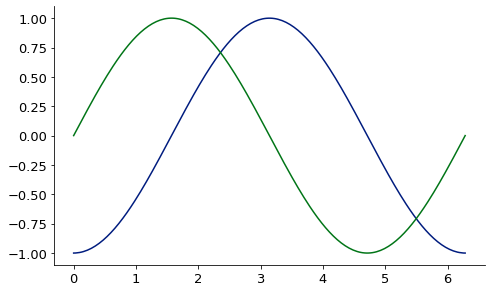
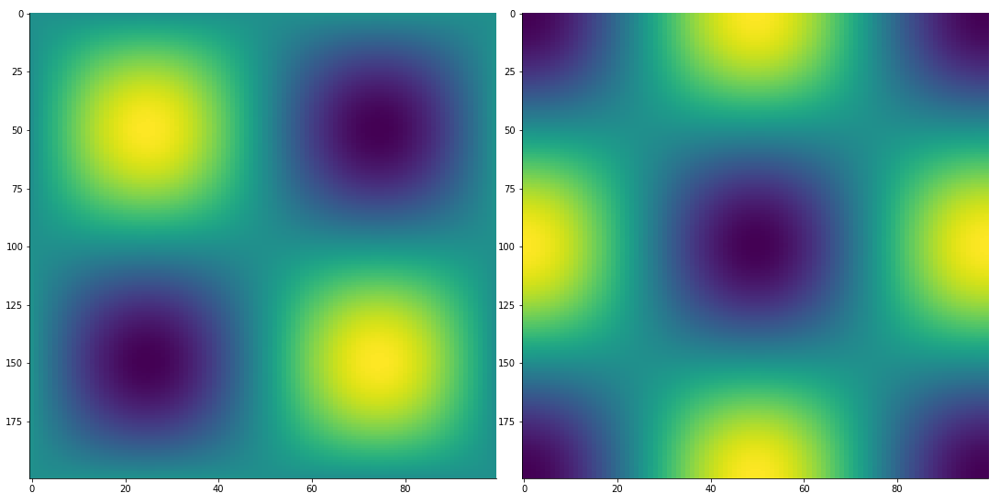
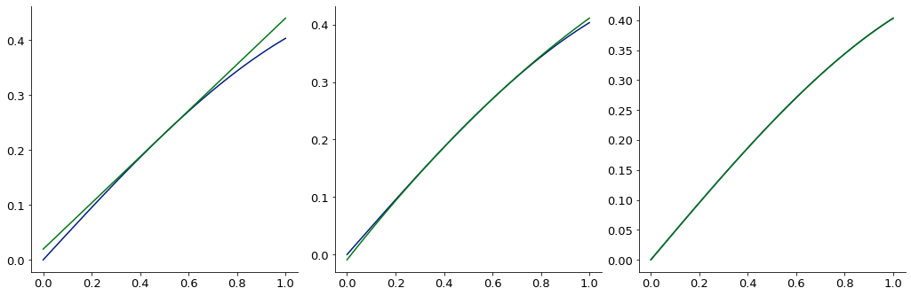

# <a id="McUtils.Zachary">McUtils.Zachary</a>
    
Handles all of the "numerical math" stuff inside Mcutils which made it balloon a little bit

### Members:

  - [FiniteDifferenceFunction](Zachary/Taylor/FiniteDifferenceFunction/FiniteDifferenceFunction.md)
  - [FiniteDifferenceError](Zachary/Taylor/FiniteDifferenceFunction/FiniteDifferenceError.md)
  - [finite_difference](Zachary/Taylor/FiniteDifferenceFunction/finite_difference.md)
  - [FiniteDifference1D](Zachary/Taylor/FiniteDifferenceFunction/FiniteDifference1D.md)
  - [RegularGridFiniteDifference](Zachary/Taylor/FiniteDifferenceFunction/RegularGridFiniteDifference.md)
  - [IrregularGridFiniteDifference](Zachary/Taylor/FiniteDifferenceFunction/IrregularGridFiniteDifference.md)
  - [FiniteDifferenceData](Zachary/Taylor/FiniteDifferenceFunction/FiniteDifferenceData.md)
  - [FiniteDifferenceMatrix](Zachary/Taylor/FiniteDifferenceFunction/FiniteDifferenceMatrix.md)
  - [FunctionExpansion](Zachary/Taylor/FunctionExpansions/FunctionExpansion.md)
  - [FiniteDifferenceDerivative](Zachary/Taylor/Derivatives/FiniteDifferenceDerivative.md)
  - [Mesh](Zachary/Mesh/Mesh.md)
  - [MeshType](Zachary/Mesh/MeshType.md)
  - [Tensor](Zachary/LazyTensors/Tensor.md)
  - [TensorOp](Zachary/LazyTensors/TensorOp.md)
  - [LazyOperatorTensor](Zachary/LazyTensors/LazyOperatorTensor.md)
  - [SparseTensor](Zachary/LazyTensors/SparseTensor.md)
  - [BaseSurface](Zachary/Surfaces/BaseSurface/BaseSurface.md)
  - [TaylorSeriesSurface](Zachary/Surfaces/BaseSurface/TaylorSeriesSurface.md)
  - [LinearExpansionSurface](Zachary/Surfaces/BaseSurface/LinearExpansionSurface.md)
  - [LinearFitSurface](Zachary/Surfaces/BaseSurface/LinearFitSurface.md)
  - [InterpolatedSurface](Zachary/Surfaces/BaseSurface/InterpolatedSurface.md)
  - [Surface](Zachary/Surfaces/Surface/Surface.md)
  - [MultiSurface](Zachary/Surfaces/Surface/MultiSurface.md)
  - [FittableModel](Zachary/FittableModels/FittableModel.md)
  - [LinearFittableModel](Zachary/FittableModels/LinearFittableModel.md)
  - [LinearFitBasis](Zachary/FittableModels/LinearFitBasis.md)
  - [Interpolator](Zachary/Interpolator/Interpolator.md)
  - [Extrapolator](Zachary/Interpolator/Extrapolator.md)

### Examples:


1D finite difference derivative via [finite_difference](Zachary/FiniteDifferenceFunction/finite_difference.md):

<div class="card in-out-block" markdown="1">

```python
from McUtils.Zachary import finite_difference
import numpy as np

sin_grid = np.linspace(0, 2*np.pi, 200)
sin_vals = np.sin(sin_grid)

deriv = finite_difference(sin_grid, sin_vals, 3) # 3rd deriv
base = Plot(sin_grid, deriv, aspect_ratio = .6, image_size=500)
Plot(sin_grid, np.sin(sin_grid), figure=base)
```
<div class="card-body out-block" markdown="1">


</div>
</div>

2D finite difference derivative via [finite_difference](Zachary/FiniteDifferenceFunction/finite_difference.md):

<div class="card in-out-block" markdown="1">

```python
from McUtils.Zachary import finite_difference
import numpy as np

x_grid = np.linspace(0, 2*np.pi, 200)
y_grid = np.linspace(0, 2*np.pi, 100)
sin_x_vals = np.sin(x_grid); sin_y_vals =  np.sin(y_grid)
vals_2D = np.outer(sin_x_vals, sin_y_vals)
grid_2D = np.array(np.meshgrid(x_grid, y_grid)).T

deriv = finite_difference(grid_2D, vals_2D, (1, 3))
TensorPlot(np.array([vals_2D, deriv]), image_size=500)
```

<div class="card-body out-block" markdown="1">


</div>
</div>

Create a convenient, low-order expansion of a (potentially expensive) function 

<div class="card in-out-block" markdown="1">

```python
def sin_xy(pt):
    ax = -1 if pt.ndim>1 else 0
    return np.prod(np.sin(pt), axis=ax)

point = np.array([.5, .5])
# create the function expansions
exp1 = FunctionExpansion.expand_function(sin_xy, point, function_shape=((2,), 0), order=1, stencil=5)
exp2 = FunctionExpansion.expand_function(sin_xy, point, function_shape=((2,), 0), order=2, stencil=6)
exp4 = FunctionExpansion.expand_function(sin_xy, point, function_shape=((2,), 0), order=4, stencil=6)

# create a test grid and plot the approximations
test_grid = np.vstack([np.linspace(-.5, .5, 100), np.zeros((100,))]).T + point[np.newaxis]
g = test_grid[:, 0]
gg = GraphicsGrid(nrows=1, ncols=3, subimage_size=350)
for i, e in zip(range(3), (exp1, exp2, exp4)):
    # plot the real answer
    gg[0, i] = Plot(g, sin_xy(test_grid), figure=gg[0, i])
    # plot the expansion
    gg[0, i] = Plot(g, e(test_grid), figure=gg[0, i])
```

<div class="card-body out-block" markdown="1">


</div>
</div>

___

[Edit Examples](https://github.com/McCoyGroup/References/edit/gh-pages/Documentation/examples/McUtils/Zachary.md) or 
[Create New Examples](https://github.com/McCoyGroup/References/new/gh-pages/?filename=Documentation/examples/McUtils/Zachary.md) <br/>
[Edit Template](https://github.com/McCoyGroup/References/edit/gh-pages/Documentation/templates/McUtils/Zachary.md) or 
[Create New Template](https://github.com/McCoyGroup/References/new/gh-pages/?filename=Documentation/templates/McUtils/Zachary.md) <br/>
[Edit Docstrings](https://github.com/McCoyGroup/McUtils/edit/master/Zachary/__init__.py?message=Update%20Docs)