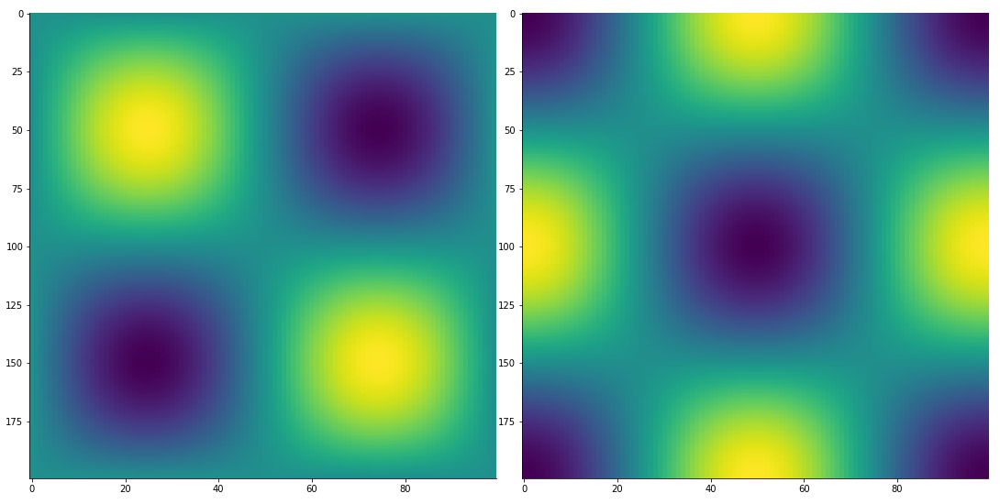
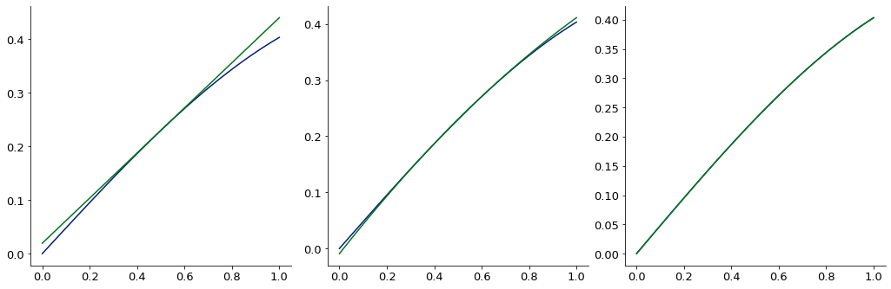

1D finite difference derivative via [finite_difference](Zachary/FiniteDifferenceFunction/finite_difference.md):

<div class="card in-out-block" markdown="1">

```python
from McUtils.Zachary import finite_difference
import numpy as np

sin_grid = np.linspace(0, 2*np.pi, 200)
sin_vals = np.sin(sin_grid)

deriv = finite_difference(sin_grid, sin_vals, 3) # 3rd deriv
base = Plot(sin_grid, deriv, aspect_ratio = .6, image_size=500)
Plot(sin_grid, np.sin(sin_grid), figure=base)
```
<div class="card-body out-block" markdown="1">


</div>
</div>

2D finite difference derivative via [finite_difference](Zachary/FiniteDifferenceFunction/finite_difference.md):

<div class="card in-out-block" markdown="1">

```python
from McUtils.Zachary import finite_difference
import numpy as np

x_grid = np.linspace(0, 2*np.pi, 200)
y_grid = np.linspace(0, 2*np.pi, 100)
sin_x_vals = np.sin(x_grid); sin_y_vals =  np.sin(y_grid)
vals_2D = np.outer(sin_x_vals, sin_y_vals)
grid_2D = np.array(np.meshgrid(x_grid, y_grid)).T

deriv = finite_difference(grid_2D, vals_2D, (1, 3))
TensorPlot(np.array([vals_2D, deriv]), image_size=500)
```

<div class="card-body out-block" markdown="1">


</div>
</div>

Create a convenient, low-order expansion of a (potentially expensive) function 

<div class="card in-out-block" markdown="1">

```python
point = np.array([.5, .5])
# create the function expansions
exp1 = FunctionExpansion.expand_function(sin_xy, point, function_shape=((2,), 0), order=1, stencil=5)
exp2 = FunctionExpansion.expand_function(sin_xy, point, function_shape=((2,), 0), order=2, stencil=6)
exp4 = FunctionExpansion.expand_function(sin_xy, point, function_shape=((2,), 0), order=4, stencil=6)

# create a test grid and plot the approximations
test_grid = np.vstack([np.linspace(-.5, .5, 100), np.zeros((100,))]).T + point[np.newaxis]
g = test_grid[:, 0]
gg = GraphicsGrid(nrows=1, ncols=3, subimage_size=350)
for i, e in zip(range(3), (exp1, exp2, exp4)):
    # plot the real answer
    gg[0, i] = Plot(g, sin_xy(test_grid), figure=gg[0, i])
    # plot the expansion
    gg[0, i] = Plot(g, e(test_grid), figure=gg[0, i])
```

<div class="card-body out-block" markdown="1">


</div>
</div>