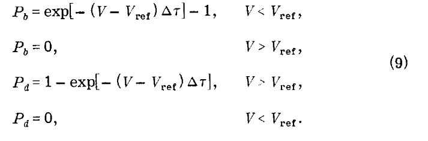

<a id="AndersonDMC" style="width:0;height:0;margin:0;padding:0;">&zwnj;</a>
<script type="text/javascript" async
  src="https://cdnjs.cloudflare.com/ajax/libs/mathjax/2.7.5/MathJax.js?config=TeX-MML-AM_CHTML">
</script>
# Simple DMC Code

This is walkthrough of a [Python implementation of Discrete Weighting DMC](https://github.com/McCoyGroup/DMC_DescendentWeighting/blob/master/HarmonicOscillatorDW.py) based on Anderson et. al. in  [this paper](https://aip.scitation.org/doi/10.1063/1.432868).

### Introduction
Diffusion Monte Carlo (DMC) is a way to solve the time-dependent Schrodinger equation (TDSE)
 using Monte Carlo sampling of a potential energy surface.  At the end of the simulation we will have a wavefunction 
 and a zero point vibrational energy.  The way we will do this is by representing our 
 wavefunciton ($\Psi$) as an ensemble of localized functions, or "Walkers", each of which represents a configuration 
 of the molecule/system of interest. We are going to represent our wavefunction as an ensemble of localized 
 functions, called "Walkers".  One can think of these as an ensemble of delta functions, taking up one point of 3N 
 configuration space. 
 
 We discretize time into "time steps", and we will displace each walker at every time step, the displacement is based on 
 a normal distribution (Gaussian), which is parametrized by the mass and the step size.  This is intuitive, since 
 a larger mass will move less, and if we are discretizing our timesteps, the larger the step, the more it should move.
 
 We will need to check the energy of each walker after it makes its step to see if it was an energetically favorable
 or not favorable move.  If it was too unfavorable, the walker might be removed from the situation.  If it was very 
 favorable, the walker may be replicated as a reward.  This whole idea of replication and deletion is referred to as 
 discrete weighting.  

### The Implementation
For simplicity of this tutorial, we are going to do a 1-dimensional DMC of the quantum model system, the harmonic oscillator.
Physically, this simulation doesn't really mean much.  This is all done in atomic units.

```python
'''Simulation Parameters!'''
import numpy as np
import math
import matplotlib.pyplot as plt
import copy

numAtoms = 1
initialWalkers = 2000
wvnmbr = 4.55634e-6 #going between atomic units and wavenumbers
omega = 2000.0000*wvnmbr #in atomic units,
dimensions = 1
mass = 1836.35/2
deltaT = 5.0 #simulation parameter - adjustable
alpha = 1.0/(2.0*deltaT) #simulation parameter - adjustable
D = 0.5
sigma = math.sqrt((2*D*deltaT)/mass) #related to the stdev of our displacement of the walkers
```


For ultra simplicity, we are also going to use a list data structure, filled with Walker objects.  This is quite inefficient.  
Talk to somebody in the group about using a numpy array structure to make your implementation more efficient.
However, this makes it ultra clear as to what we are doing.  Each walker has a coordinate and a potential
```python
class Walker:
    def __init__(self):
        self.coords = np.zeros((numAtoms,dimensions)) #1d surface
        self.WalkerV = 0.0
myWalkers = [Walker() for r in range(initialWalkers)]
```

### The Overall Algorithm
We can write our algorithm as a loop over n time steps.  At the end of the n time steps, the simulation is over!
For now, ignore the if statement that asks if we're > 950 time steps. We'll get there in a bit.
```python
#Start!
vrefAr = np.zeros(1000)
xc = []
popAr = np.zeros(1000)
Vref = 10000
DW = False
for i in range(1000):
    moveRandomly()
    getPotentialForWalkers()
    if i==0:
        Vref = getVref()
    if i>=950:
        DW = True
        if i==950:
            whoFrom = np.arange(len(myWalkers))
            oneHundo = copy.deepcopy(myWalkers)
    whoFrom = birthOrDeath(Vref,whoFrom,DW)
    getPotentialForWalkers()
    Vref = getVref()
    #Plotting business
    vrefAr[i] = Vref
    popAr[i] = len(myWalkers)

```
As you can see, this is a pretty simple algorithm. The main thing that may be confusion right now is Vref.
We can calculate the average potential of our ensemble, and correct it with the fluctuation in the population to eventually
get our zero point energy.  This is what we refer to as Vref in the simulation.  In my implementation, I set Vref really high 
to start, but we will calculate vref in the first time step so it doesn't really matter.

Algorithmically, we run the simulation for 1000 time steps. During that time, we displace, we evaluate energy, we see 
if walkers should die or replicate, and then we recalculate vref.  

Throughout the simulation, we collect Vref at every time step, the average of which will be our zero point energy.  
We can collect the population so that we can make sure we don't have a massive walker die off, which kills the simulation.

### moveRandomly()
```python
def moveRandomly():
    #choose a random number from gaussian distribution (1/2pisig)(e^(-dx^2/1sig^2))
    for p in range(len(myWalkers)):
        gaussStep = np.random.normal(loc = 0.00000000000000,scale=sigma)
        myWalkers[p].coords = myWalkers[p].coords + gaussStep
```
This method is pretty self explanatory, we are using the numpy random number generator to update our coordinates by first
getting a step and then adding the displacement to our coordinates.


### getPotentialForWalkers()

The potential is usually more complicated for real systems, but since we are using a harmonic oscillator the potential
is trivial:
$V\_HO(x) = (1/2)*k*x^2 = (1/2)*m*w^2$

```python
def getPotentialForWalkers():
	omsqd = math.pow(omega,2)
    prefactor = 0.50000*mass*omsqd
    for d in range(len(myWalkers)):
        crds = float(myWalkers[d].coords)
        crdssq = math.pow(crds,2)
        myWalkers[d].WalkerV = (prefactor*crdssq)
```

### getVref()

Vref is the average of each of the potential values of the walker, and is corrected
by how much the population shifts from the intial amount (basically a percent change).  Alpha is a simulation parameter
based on the time step.

```python
def getVref(): #Use potential of all walkers to calculate vref
    varray = np.array([k.WalkerV for k in myWalkers])
    Vbar = np.average(varray)
    vref = Vbar - alpha*((float(len(myWalkers))-float(initialWalkers))/float(initialWalkers))
    return vref
```

### birthOrDeath(Vref,whoFrom,DW)
The most complicated part of the algorithm is the birth and death criteria, but we have a formula from the paper!

 	

The way I handle this is by going through each of the walkers.  I split it up into a favorable or unfavorable move
(curV > Vref , else curV < Vref).  I calculate the probablility and then grab a random number.  Using the random number,
I check if the walker should be removed or duplicated (or left along).  I have a deathAr which is a list that holds the 
index of the walker that must die, and then a birthAr that appends the ENTIRE WALKER, coordinates and potential, marked for replication.

I delete the walkers in a reversed fashion not to mess up the indexing, and then use the birthAr to just stick those 
replicated walkers on at the end.  If I used an index for birthAr, it would have become messy from the deletion of walkers.
```python
def giveBirth(singleWalker):
    myWalkers.append(singleWalker)

def deleteWalker(walkerIndex,whoFr,Desc):
    del myWalkers[walkerIndex]
    if Desc:
        whoFr = np.delete(whoFr,walkerIndex)
    return whoFr

def birthOrDeath(vref,whoFr,Desc):
    deathAr = []
    birthAr = []
    birthArInd = []

    for y in range(len(myWalkers)):
        Rng = np.random.random()
        curV = myWalkers[y].WalkerV

        if curV > Vref:
            P = -1*(curV - Vref)*deltaT
            exP = math.exp(P)
            if exP < Rng:
                deathAr.append(y)
        else:
            P = -1*(curV - Vref) * deltaT
            exP = math.exp(P) - 1
            if exP > Rng:
                singleWalker = copy.deepcopy(myWalkers[y])
                birthAr.append(singleWalker)
                if Desc:
                    #get the index from where the pregnant walker is from
                    birthArInd.append(whoFr[y])

    if deathAr: #If it's not empty
        for k in reversed(deathAr):
            whoFr = deleteWalker(k,whoFr,Desc)
    if birthAr:
        for j in birthAr:
            giveBirth(j)
        if Desc:
            whoFr = np.concatenate((whoFr, birthArInd))


    del deathAr[:]
    del birthAr[:]

return whoFr
```

## Descendant Weighting
I have been ignoring things like whoFr, and Desc and the 950 index in my code because all of that is part of Descendant 
weighting.  Descendant weighting is effectively another way to get a representation of $\Psi$, so we can calculate
expectation values and do projections of the probability density of the wavefunction rather than just the wavefunction itself.

Effectively, in the last 50 time steps of the code, we maintain a running list of which walkers are deleted or replicated,
and then trace it back to the ensemble at time 950.  We then weight those walkers by their descendants.  The additions we
need are only in the birth or death function and a little bit of clean up at the end.  I update which walkers are replicated
with the whoFr array, and count how many walkers came from a parent walker at the end of the simulation with 

```python
unique,counts = np.unique(whoFrom,return_counts=True)
z=0
for u in unique: #teehee
    dWeights[u]=counts[z]
z+=1
```

And that's it! Ask a bunch of questions to the person who directed you here so that you can understand each part better :).