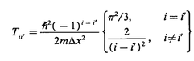

<a id="colbertandmiller" class="Section" style="width:0;height:0;margin:0;padding:0;">&zwnj;</a>

# Colbert and Miller 1D DVR

This is an implementation of the DVR on the  `[-∞, ∞]` range as defined by Colbert and Miller in  [this paper](http://xbeams.chem.yale.edu/~batista/v572/ColbertMiller.pdf) .

<a id="grid" class="Subsubsection" style="width:0;height:0;margin:0;padding:0;">&zwnj;</a>

### Grid

We simply discretize our domain evenly. Implicit is that the domain is  *effectively* the  `[-∞, ∞]` range.

```python
'''Colbert and Miller DVR on the [-inf, inf] domain'''

def dvr_grid(domain=(-5, 5), divs=10, **kw):
    '''Calculates the grid'''
    rmin=domain[0]; rmax=domain[1];
    inc=(rmax-rmin)/(divs-1)

    return [rmin+i*inc for i in range(divs)]
```

<a id="kineticenergy" class="Subsubsection" style="width:0;height:0;margin:0;padding:0;">&zwnj;</a>

### Kinetic Energy

One nice part of this DVR is that it has no explicit dependence on the basis. In fact the only way it depends on the grid is in the grid spacing, Δx, and the number of nodes. This leads to a very simple implementation. The kinetic energy  is defined by:



And so we can write the kinetic energy as:

```python
def dvr_ke(grid, m=1, hb=1):
 '''Computes the kinetic energy for the grid (based on the chosen basis)'''
 import numpy as np

 dx=grid[1]-grid[0]
 divs=len(grid)
 ke=np.empty((divs, divs))

 coeff=(hb**2)/(2*m*(dx**2))

 for i in range(divs):
  for j in range(divs):
   if i==j:
    ke[i, j]=((-1)**(i-j))*coeff*(math.pi**2)/3
   else:
    ke[i, j]=((-1)**(i-j))*coeff*(2)/((i-j)**2)

 return ke
```

<a id="potentialenergy" class="Subsubsection" style="width:0;height:0;margin:0;padding:0;">&zwnj;</a>

### Potential Energy

The potential is simple as is usually the case, so if we have a potential function as a function of the grid point,  `pot` we can write this as

```python
def dvr_pe(grid, pot=None):
 '''Computes the potential energy from the gridpoints'''
 import numpy as np

 return np.diag([pot(x) for x in grid])
```

<a id="wavefunctions" class="Subsubsection" style="width:0;height:0;margin:0;padding:0;">&zwnj;</a>

### Wavefunctions

This will also operate in the usual way, so we have

```python
def dvr_wfns(ke, pe):
 '''Computes the wavefunctions'''
 import numpy as np

 return np.linalg.eig(ke+pe)
```

<a id="alltogether" class="Subsection" style="width:0;height:0;margin:0;padding:0;">&zwnj;</a>

## All Together

```python
'''Colbert and Miller DVR on the [-inf, inf] domain'''

def dvr_grid(domain=(-5, 5), divs=10, **kw):
    '''Calculates the grid'''
    rmin=domain[0]; rmax=domain[1];
    inc=(rmax-rmin)/(divs-1)

    return [rmin+i*inc for i in range(divs)]

 def dvr_ke(grid, m=1, hb=1, **kw):
 '''Computes the kinetic energy for the grid (based on the chosen basis)'''
 import numpy as np

 dx=grid[1]-grid[0]
 divs=len(grid)
 ke=np.empty((divs, divs))

 coeff=(hb**2)/(2*m*(dx**2))

 for i in range(divs):
  for j in range(divs):
   if i==j:
    ke[i, j]=(-1**(i-j))*coeff*(math.pi**2)/3
   else:
    ke[i, j]=(-1**(i-j))*coeff*(2)/((i-j)**2)

 return ke


def dvr_pe(grid, pot=None, **kw):
 '''Computes the potential energy from the gridpoints'''
 import numpy as np

 return np.diag([pot(x) for x in grid])

def dvr_wfns(ke, pe, **kw):
 '''Computes the wavefunctions'''
 import numpy as np

 return np.linalg.eig(ke+pe)

def dvr_run(**params):
 '''Runs the entire DVR'''
 grid = dvr_grid(**params)
 ke = dvr_ke(grid, **params)
 pe = dvr_pe(grid, **params)
 wfns = dvr_wfns(ke, pe, **params)

 return wfns


if __name__=='__main__':
 ### parse sys.argv

 dvr_run(**ops)
```
