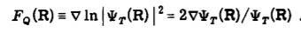
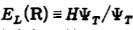

<a id="ReynoldsDMC" style="width:0;height:0;margin:0;padding:0;">&zwnj;</a>

# Importance Sampling

### Introduction

This is a simple implementation of importance sampling based on Reynolds et. al. in [this paper](https://aip.scitation.org/doi/abs/10.1063/1.443766). Importance sampling is a method that we can employ in Diffusion Monte Carlo (DMC) that can greatly speed up our calculation by using a trial wavefunction. The trial wavefunction acts as a guiding function that helps guide the DMC wavefunction toward the exact wavefunction and the zero-point energy by giving a good approximation of the wavefunction. 

We can think of defining the new DMC wavefunction as the exact wavefuntion divided by this trial wavefunction. When we plug this new DMC wavefunction into the time-dependent Schordinger equation, we get new terms that we have to account for. In particular we get a drift term that shifts our kinetic energy term and instead of just evaluating the potential at each time step, we have to evaluate the local energy of the walker.

### Beginning of Implementation

We will first work with a simple case where we are going to perform DMC on a 1-D model with a Morse potential given a harmonic oscillator wavefunction as our trial wavefunction. We will choose our potentials to have the same frequency to keep the potentials similar to each other. We will simulate the potential of an OH stretch for this simulation. The simulation parameters are given below:
```python
'''DMC parameters'''
import numpy as np
import copy

dtau = 1.  # the size of our timestep
N_0 = 500  # number of walkers
timesteps = 1000.  # number of timesteps for the simulation
alpha = 1./(2.*dtau)

'''Constats and conversion factors'''
me = 9.10938356e-31  # mass of an electron
Avo_num = 6.0221367e23
m_O = 15.994915 / (Avo_num*me*1000)
m_H = 1.007825 / (Avo_num*me*1000)
m_red = (m_O*m_H)/(m_O+m_H)  # reduced mass of an OH stretch
har2wave = 219474.6  # conversion from hartrees to wavenumbers

'''Parameters for the potential'''
De = 0.1896  # parameter in the Morse oscillator
sigmaOH = np.sqrt(dtau/m_red)
omega = 3600./har2wave  # frequency of the oscillation
mw = m_red * omega
A = np.sqrt(omega**2 * m_red/(2*De))  # parameter in the Morse oscillator
```

We will generate our list of walkers to have the following properties for ease of use: 
```python
class Walkers(object):
    def __init__(self, walkers):
        self.walkers = np.linspace(0, walkers-1, num=walkers) # to keep track of the walker number
        self.coords = np.zeros(walkers)
        self.weights = np.zeros(walkers) + 1.
        self.d = np.zeros(walkers)
        self.weights_i = np.zeros(walkers) + 1.
        self.V = np.zeros(walkers)  # walker potential
        self.El = np.zeros(walkers)  # walker local energy
```
The next few steps will cover the following functions that we need in order to implement importance sampling:

* Trial Wavefunction

* Drift

* Metroplis Sampling

* Second Derivative of Trial Wavefunction

* Local Energy

### Trial Wavefunction 

Since we are using a simple harmonic oscillator as our trial wavefunction, we will be using the analytical form for these next few parts. However, one could imagine using an interpolated wavefunction that you could obtain from DVR.

```python
def psi_t(coords):
	'''Computes the trial wavefunction at each of the coordinates of the walkers'''
	return (mw/np.pi)**(1./4.)*np.exp(-(1./2.*mw*coords**2))
```

### Drift

From Reynolds et. al., they define an extra term in the kinetic energy that they equate to a "quantum force". It is equal to the following:



Since we know the derivative of the harmonic oscillator ground state wavefunction analytically, the drift term in this case is very simple:

```python
def drift(coords):
	'''Computes the drift term for use in the kinetic energy'''
    return -2.*mw*coords 
```

### Metropolis Sampling

Typically when using DMC, there is an equal probability of the walker being displaced in any direction. However, with the drift term, that may not hold true. Therefore, this step is included to allow the system to uphold microscopic reversibility. This equation uses the Green's functions that correspond to the time-dependent Schrodinger equation with this definition of the DMC wavefunction.

```python
def metropolis(x, y, Fqx, Fqy):  # Metropolis step to determine the ratio of Green's functions
    psi_x = psi_t(x)
    psi_y = psi_t(y)
    pre_factor = (psi_y/psi_x)**2
    M = pre_factor*np.exp(1./2.*(Fqx + Fqy)*(sigmaOH**2/4.*(Fqx-Fqy) - (y-x)))
    return M
```

This ratio is then compared to a random number between 0 and 1 and if the ratio is greater than that number, the move is accepted. This is implemented into the kinetic energy below:

```python
def Kinetic(Psi, Fqx):
    randomwalk = np.random.normal(0.0, sigmaOH, N_0)
    Drift = sigmaOH**2/2.*Fqx
    y = Psi.coords + randomwalk + Drift
    Fqy = drift(y)
    a = metropolis(Psi.coords, y, Fqx, Fqy)
    check = np.random.random(size=N_0)
    accept = np.argwhere(a > check)
    Psi.coords[accept] = y[accept]
    return Psi, Fqy
```


### Second Derivative and Local Energy

The local energy of the walkers is given by the following equation:



This means that we need the second derivative of the trial wavefunction for the kinetic energy operation. Again, since we are using an analytic wavefunction, this is trivial to caluclate. This, along with the potential energy evaluation forms the local energy.

```python
def sec_dir(coords):
    return (mw/np.pi)**(1./4.)*np.exp(-(1./2.*mw*coords**2))*(mw**2*coords**2-mw)


def E_loc(Psi):
    psi = psi_t(Psi.coords)
    kin = -1./(2*m_red)*sec_dir(Psi.coords)/psi
    pot = Psi.V
    Psi.El = kin + pot
    return Psi 
```

### All Together

That's all the pieces we need to construct an importance sampling DMC algorithm. If your trial wavefunction is an eigenstate of the Hamiltonian that you are using, your zero-point energy should be constant. This is a good check that your code is working. If you have any more questions, feel free to ask one of the group members! 
