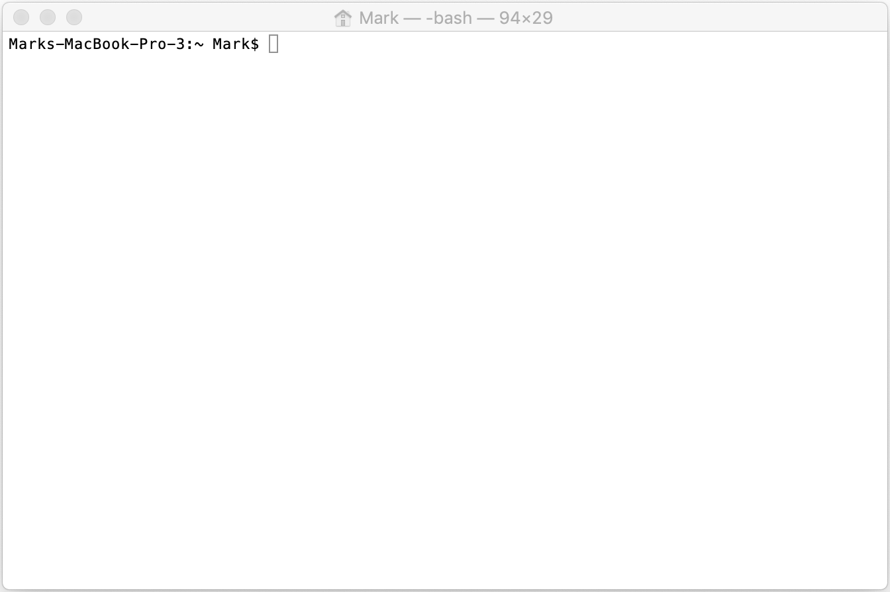

# Your First Python Script

The biggest hurdle to overcome when starting out isn't the kind of abstract thinking coding requires, nor is it needing to understand the syntax of the language, and it's definitely not needing to know how computers do what they do--very few programmers actually know that.
Instead, it's literally just getting everything installed and playing nicely together.
So we're gonna walk through the basics of what'll be needed to get through this tutorial.

## Set Up

### Installing Python

If you start googling around, one of the first things you'll figure out about python is that there are two main versions of it. There's python2, which first came out in 2000, and python3 which came out in 2008.
Migration to python3 has been [incredibly slow](https://stackoverflow.blog/2019/11/14/why-is-the-migration-to-python-3-taking-so-long/), so you'll probably see stuff talking about python2 when you try to look stuff up on the internet.
Despite that, we really want to be using python3. The features are worth it, and python2 is no longer supported.
So with that probably unnecessarily long preamble out of the way, what do we need to do? Well first we'll go to the [Python Organization downloads page](https://www.python.org/downloads/) and download whichever version they're saying is the latest (as of writing this that's currently 3.8).
That should download an installer and we'll just do what the python.org people tell us to do to get it installed.

### Installing PyCharm

If you'd like, feel free to jump directly to installing [PyCharm](https://www.jetbrains.com/pycharm/).
It's a tool that makes it way easier to write python code that doesn't have bugs in it.
We'll continue on as if you hadn't done so, but you'll probably want to install it before long, so why not now?

### Interactive Python

Python provides us with something called a _read-evaluate-print loop_ (REPL) which is just a way to interactively play around with the language.
We can fire this up by opening up the _command prompt_ which is just a way that we can interact with our computer directly via commands, rather than by clicking on icons and stuff.
On Mac this is a program called Terminal, on Windows it's called Command Prompt.
If you're using Linux, there's a decent chance you're already familiar with the command prompt, which is good because I don't know how to open it on Linux.

In any case, no matter which you use you should see a blank, bare bones window in which to type stuff. Mine looks like

{: width="500px"}

on that blank line, assuming everything installed nicely, we can just type

```console
$ python3
```

and then when we press enter we should get a response like this

```console
$ python3
Python 3.7.0 (v3.7.0:1bf9cc5093, Jun 26 2018, 23:26:24) 
[Clang 6.0 (clang-600.0.57)] on darwin
Type "help", "copyright", "credits" or "license" for more information.
>>> 
```

That `>>>` tells us that python is ready to read what we write, evaluate it, and print out a result.
I'm not sure how much we want to belabor python syntax or anything like that, seeing as there are tutorials out there that teach the syntax very well, e.g. the proper [Code Academy](https://www.codecademy.com/learn/learn-python-3) ones or, just because I got my start programming with them, the [MIT OCW lectures](https://ocw.mit.edu/courses/electrical-engineering-and-computer-science/6-0001-introduction-to-computer-science-and-programming-in-python-fall-2016/lecture-videos/index.htm).
That said, we'll quickly run through how we can use this to explore.

Let's try a series of inputs

```
>>> 1 # just a number for python to spit out
1
>>> 1+1 # we can add
2
>>> 1+1+1 # we can do lots of adding
3
>>> 1*5 # we can multiply
5
>>> 'my cat' # python supports word-like stuff (always called strings in the programming world)
'my cat'
>>> 'my cat'*5 # you can multiply strings by integers to repeat them
'my catmy catmy catmy catmy cat'
>>> ['my cat]*5 # if your syntax is wrong python will whine at your
  File "<stdin>", line 1
    ['my cat]*5
              ^
SyntaxError: EOL while scanning string literal
>>> ['my cat']*5 # you can repeat stuff in lists by multiplying by an integer (a list is just python's name for a sequence of stuff)
['my cat', 'my cat', 'my cat', 'my cat', 'my cat']
>>> ';_;'.join(['my cat']*5) # if you've got a bunch of strings in a list, you can join them
'my cat;_;my cat;_;my cat;_;my cat;_;my cat'
```

I'm not gonna run through all the possible options, since the only way to learn is to play around with it.
Something that gets lost in discussions of how to learn to program is that it should be _fun_.
It's a way to explore ideas and build tools that you can share with other people, so have fun with it.
Do silly things, make mistakes, hack into the NSA's servers, sell state secrets to the highest bidder, get arrested, etc.
This is a great time to explore, and the moment you turn 18 all of that gets expunged from your permanent record.

## Writing and Running a Script

If you haven't already installed PyCharm, now might be a good time to.
Definitely no need to, but it might help with writing the code.
As before, I'll pretend we haven't.
You will, however, need _some_ way to edit a file.
Most operating systems have one built in. Windows has Notepad++, Mac has TextEdit. If you're on Linux...maybe `vim` is all you have?
Once again, I've got no idea, but hopefully you do.

So after all that playing around we're ready to start writing a script that'll do something super cool.
What this super cool thing is...well that's still TBD.
For now we're just gonna write a script that says rude things about someone named Ryna.
To do so we'll make a file called `im_a_jerk.py`.

In it, to start, we'll put this content

```python
person = "Ryna"
place = "New Jersye"
bad_place = "Princeton"
print(f"{person} is from {place}. You know what's in {place}? {bad_place}")
```

then to run this we'll do

```console
$ python3 im_a_jerk.py
Ryna is from New Jersye. You know what's in New Jersye? Princeton
```

but...well that feels like a bit of a low blow (sorry Ryna).
So let's change this up to be a bit nicer.
We'll replace Princeton with an objectively better place, like Trenton.
So we'll change our script to look like

```python
person = "Ryna"
place = "New Jersye"
better_place = "Trenton"
print(f"{person} is from {place}. You know what's in {place}? {better_place}")
```

and then we get

```console
$ python3 im_a_jerk.py
Ryna is from New Jersye. You know what's in New Jersye? Trenton
```

at this stage we can do all sorts of stuff.

We could change our script so that instead of having to change up the actual body of the script we load the `person`, `place`, and `bad_place` from another file. Or we could pass them directly on the command line, (i.e. with `$ python3 im_a_jerk.py Mark Michigan Marquette`).
The possibilities are endless, and the best thing to do is explore for yourself.

Instead, we'll move onto discussing some tips for making it easier to write code that does interesting stuff.
Don't feel like you need to plow straight on, though.
Play around for a while and go on when you're ready.

Next: [To Functions and Beyond](FunctionsAndBeyond.md)<br/>
Previous: [Introduction](intro.md)<br/>
Got questions? Ask them on the [McCoy Group Stack Overflow](https://stackoverflow.com/c/mccoygroup/questions/ask)

---
[Edit on GitHub](https://github.com/McCoyGroup/References/edit/gh-pages/McCoy%20Group%20Code%20Academy/GettingStarted/CommonIssues.md)