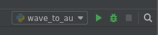

# Your (Potentially) First Python Script

Whether or not you've written code before, this may very well be your first dive into coding for quantum chemistry.
We won't start out super sophisticated, as this probably is your first python script in this context.
The idea with this tutorial is to set up some of the things we think our fundamental to writing code to handle more sophisticated problems.
As you start working on your own research, we hope that you remember these steps.

## Writing a Script

We're gonna write a script that converts from wavenumbers ($cm{^-1}$), the energy unit we like to work, to Hartree ($E_h$), the [atomic unit](https://en.wikipedia.org/wiki/Hartree_atomic_units) of energy.
To do so we'll make a file called `wave_to_au.py`.

In it, to start, we'll put this content:

```python
frequency = 3600  # the frequency of an OH strech in water 
conversion_factor = 219474.6  # cm^-1 = 1 Hartree
frequency_au = frequency / conversion_factor
print(f"{frequency} wavenumbers is {frequency_au} in Hartree")
```
Now, let's break this down a little bit:
1. Define variables, `frequency` and `conversion_factor`.
2. Convert the frequency. 
3. Print a _F-String_ showing the input frequency and the converted frequency.


**A Note on F-Strings**: [A relatively new addition to python](https://realpython.com/python-f-strings/#f-strings-a-new-and-improved-way-to-format-strings-in-python), this is one of your best friends for checking values and debugging.
You define an f-string by placing a lowercase `f` in front of your string quotes like so, `f"..."`.
You can type and insert variables directly by enclosing them in curly brackets `{}`.
Then when the `print()` function prints your string to the command window (or the Run window in PyCharm), it fills in the blanks with the values of the variables you provided.

## Running a Script

In order to see if/how this is working, we will want to run our script. To do that in PyCharm, you can either right-click in the Script Editor and click run or in the top right corner you can press the green play button. This should like something like this:



It is important to note here that the file listed to the left of the green play button is the file that will run when you press it. You can change it using the dropdown arrow.

After running, you should see the following output:
```python
"3600 wavenumbers is 0.01640280925446498 in Hartree"
```

Congrats! You did it! 

**Bonus Round**: If you don't want _all_ those digits on your Hartree value, you can edit the value that gets printed in the f-string. This is cool because it doesn't change the value of the variable `frequency_au`. In order to do this, you can tell the string how many values to print. This looks like:
```python
print(f"{frequency} wavenumbers is {frequency_au:.5f} in Hartree")
```
where we added `:.5f` behind the `frequency_au` variable. This means we want to print `5` digits of the `f`loat behind the decimal point. Give it a shot!

### What else can we do with this?

You're probably thinking "That's great and all but..." and that's good.
What if you tried a script like `rad_to_degree.py` or maybe even `ang_to_bohr.py`?
Or if you are thinking "Well what if I want to convert a different frequency? or a lot of frequencies?" you might want to try: [How to Write A Function](HowToWriteAFunction.md).
Play around with things for a while and go on when you're ready.


<span class="text-muted">Next:</span>
 [How to Write a Function](HowToWriteAFunction.md)<br/>
<span class="text-muted">Previous:</span>
 [What is an IDE?](IntroToIDEs.md)

Got questions? Ask them on the [McCoy Group Stack Overflow](https://stackoverflow.com/c/mccoygroup/questions/ask)
{: .alert .alert-info}

---
[Edit on GitHub <i class="fab fa-github" aria-hidden="true"></i>](https://github.com/McCoyGroup/References/edit/gh-pages/McCoy%20Group%20Code%20Academy/GettingStarted/CommonIssues.md)
