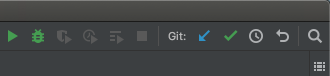
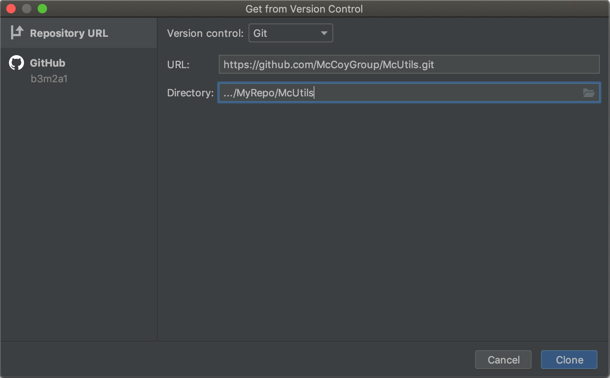

# What is an IDE?

Writing code can be a huge pain. Computers are the ultimate pedants, and it's easy to make subtle mistakes that are hard to catch.
In the bad old days, people didn't have tools to help them write their code, and it can be a fun exercise to write code without them, just to see the kind of mental strain it requires.
We're not going to do that, though.
Tools are your friend and we're going to use them so that we can spend more time doing science and less time writing code.
The main tool we're going to use is an _integrated development environment_ (IDE), which is a fancy name for a program that you use to edit your code that also helps you out.
IDEs are the bees knees. There's also a bajillion of them out there.
We're going to make our recommendation, but as with all things, you should do what works best for you.

## PyCharm

JetBrains has made a truly great Python IDE called [PyCharm](https://www.jetbrains.com/pycharm/).
There's a free community version and also a paid professional version. As someone with a `@uw.edu` email, you can use the pro version for free.

It'll format your code so it's easier to read, catch any errors in your syntax, provide helpful hints and suggestions as you write, and give you a powerful _debugger_ to help you find issues once your code runs.

Even better, it's easy to install.

### Installing on the Group Computers

If you're working on Argon or Neon, we've already installed the [JetBrains Toolbox](https://www.jetbrains.com/toolbox-app/), which is just a manager for PyCharm and its sibling IDEs.
To use it we just SSH onto the computer and run

```console
$ cd /opt/jetbrains-toolbox.../
$ ./jetbrains-toolbox
```

This should pop up an interface where you can download PyCharm (It'll give you the option to do the Community or Pro Editions. As mentioned before, Pro requires a .edu address, The group doesn't use the extra features of Professional all that much).

Once this is done downloading and you go through the setup, you should be able to run PyCharm by simply running `pycharm` on the command line.
If this doesn't work or you're running on one of the machines where the JetBrains Toolbox isn't installed, talk to one of the senior group members.

### Installing on Your Own Computer

_We recommend you install Anaconda, first._

You can find the installer for PyCharm [here](https://www.jetbrains.com/pycharm/).
Just follow the instructions laid out by JetBrains. We usually just use their recommended setting.
Once installed, open it up and follow the configuration instructions.
For the most part, you shouldn't need any of their "Featured Plugins" until you start to write a lot of Shell scripts or Markdown or the like.

### Configuring PyCharm after Installation

_JetBrains has [documented this](https://www.jetbrains.com/help/pycharm/configuring-project-and-ide-settings.html) for us. We're putting this here to give you a "kinder" intro._

PyCharm expects us to put our different bits of code in various "projects".
To start out, we'll just make one called either "Basic Testing" or some devastatingly witty and clever name.
Being neither witty nor clever, we can only suggest the former to you.

You can put the project directory anywhere. Good practice would have you make a folder that holds all of your coding-related work and put the project inside there.
It will ask for an interpreter, which is just their way of asking which version of python to use.
If we were real software developers, we'd need to think carefully about what we wanted to do.
Happily, we're not, so this is straightfoward.
Just go over to `Existing Interpreter`, then click on the `...` box on the side.
Choose `System Interpreter` in the dropdown on the left and you should be able to select your Anaconda installation.
Press ok through everything and then you should see your project bar on the far left.
It will take a few minutes to have your Anaconda installation fully make its way into PyCharm, so be patient.
As it runs, it'll say stuff like  "updating skeletons" or "2 processes running" on the bottom right.

### Git Integration

As we noted earlier, writing code can be a huge pain.
There is a 100% chance you're going to make mistakes.
And there's also a 100% chance that, at some point, when you try to fix your mistake you end up breaking something else.
Commonly, you manage to break something unexpectedly _and also_ fail to fix your original mistake.
The technical term for this is _super duper annoying_.

In the same way that people of yore made IDEs to make writing code less sucky, they also made tools to track our changes for us so that we can see what we've broken. This stuff is called _version control software_ (VCS).
The tool that we and a majority of the programmers of the world use is called [`git`](https://git-scm.com/).
Unfortunately, `git` is a confusing piece of software that was designed to be used on the command line.
To get around this, people have made versions of it that have nice interfaces, like [GitHub Desktop](https://desktop.github.com/).

PyCharm, the wonderful tool that it is, also includes an interface so that we never need to leave our IDE.
JetBrains has [documented this](https://www.jetbrains.com/help/pycharm/set-up-a-git-repository.html) for us, too.
All of these settings are in the `VCS` menu at the top of PyCharm.
Once we've got a project set up, we just click on `VCS » Enable Version Control Integration` and select `Git`.

In the same way that PyCharm calls folders it manages "Projects", Git calls them "Repositories".
So to tell `git` to track changes in our PyCharm project we click `VCS » Import into Version Control » Create Git Repository`.
Once we've done this, we'll see three buttons appear in the top-right of the PyCharm window

{:width="330px"}

These will let us do stuff like "commit" changes and check the history of a file.
As with voting in Chicago, _commit early and commit often_.
You don't want to break something and then only realize after the fact that you never saved the version where it worked.

## Installing Packages

It's good practice to try to write introductory things and things pertinent to your understanding on your own.
It's also good practice to outsource unnecessary bits to other people.
Python encourages code reuse by making it easy for people to share their packages.

We've got two main ways to install other packages.
If the person who wrote it put in the necessary work, PyCharm provides us with the ability to install from the "official" package source.

For most group-related code, we'll use `git` to install it off of [GitHub](https://github.com/). GitHub is just a site for people to share/store/display code they've managed using `git`.
The group has its own [GitHub](https://github.com/McCoyGroup).
This site itself is even hosted by GitHub. Once you're ready, you should get on GitHub, too, at the very minimum because having a documented history of developing code looks good when applying to technical positions.

PyCharm lets us install packages from GitHub by allowing us to "clone" a repository into our local one.
To do this, we go to `VCS » Git » Clone...` which opens a pop-up window in which we can specify what package we want to install and where we want to install it to

{:width="550px"}

For code in one of our McCoy Group repositories, the URL to install from will look like `https://github.com/McCoyGroup/<PackageName>.git`.
You'll want to install it somewhere that python can find it.
The easiest thing to do, there, is to put it inside your current repository.

There are lots of subtleties and things we could discuss here, but that's probably not worth it.
At least now you should be set up to reuse what your group members have done.


<span class="text-muted">Next:</span>
 [Your First Python Script](FirstPythonScript.md)<br/>
<span class="text-muted">Previous:</span>
 [An Introduction to Python/Anaconda](IntroToPython.md)
 
 Got questions? Ask them on the [McCoy Group Stack Overflow](https://stackoverflow.com/c/mccoygroup/questions/ask)
{: .alert .alert-info}

---
[Edit on GitHub <i class="fab fa-github" aria-hidden="true"></i>](https://github.com/McCoyGroup/References/edit/gh-pages/McCoy%20Group%20Code%20Academy/GettingStarted/IntroToIDEs.md)
