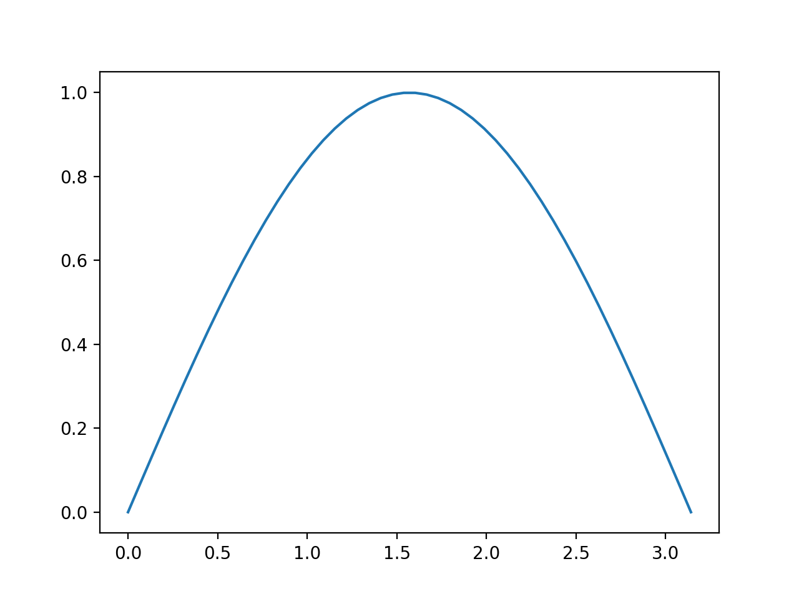
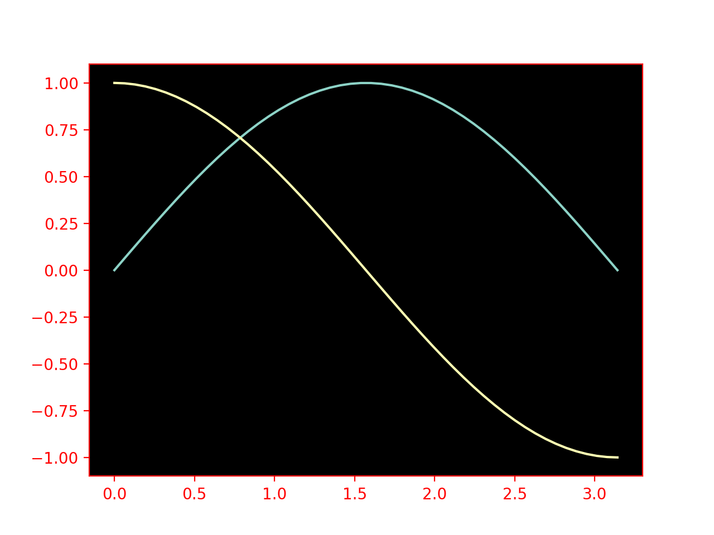
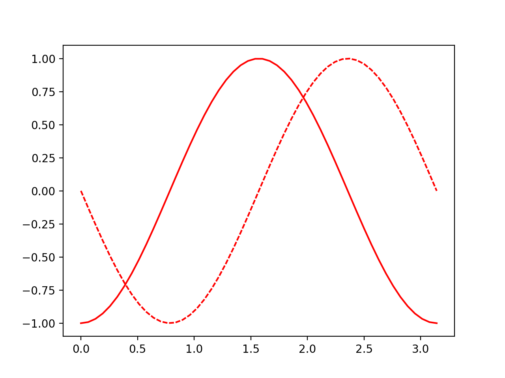
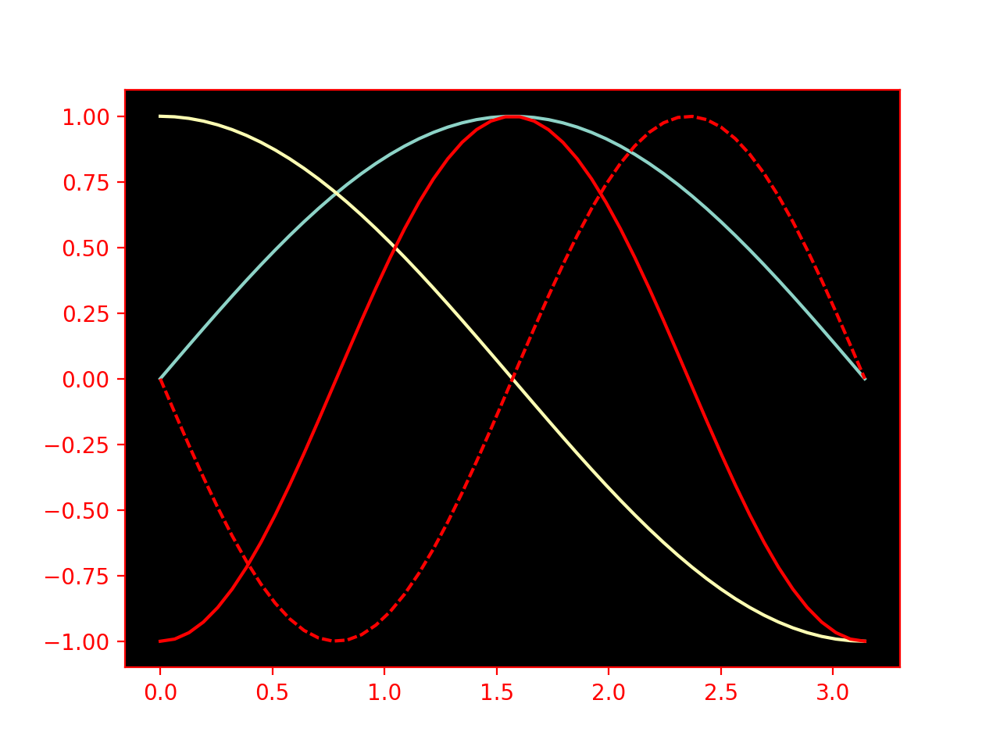
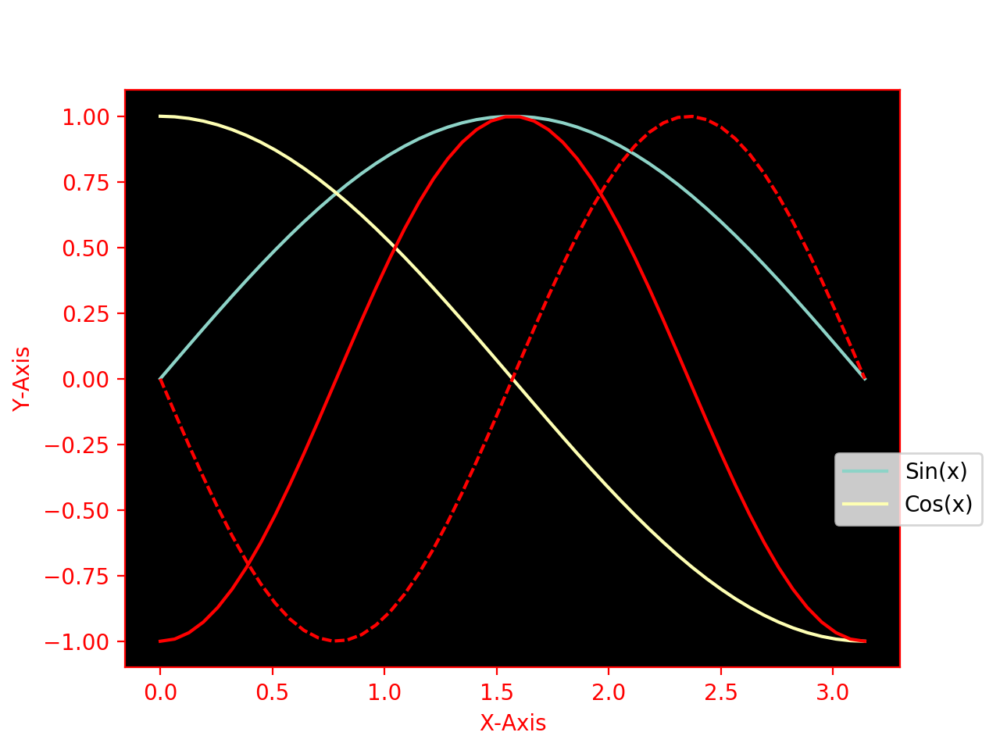

# Advanced Plotting with Matplotlib 

For completely historical reasons, `matplotlib` has two different ways to interact with it.
There's a normal python-style object-oriented interface with `Figure` and `Axes` objects and a weird, vestigial, MATLAB-style `pyplot` module.

With the exception of one single function, we're not going to talk about the `pyplot` interface at all in this discussion, because we'd recommend that you not use it.
Instead, we'll just focus on the basics for how to get started and show you how to build your own interface that makes plotting easier and more natural.

The entirety of this getting-started guide will be done with classes and object-oriented programming, so if you're not comfortable with that it might be worth [refreshing your memory](../GettingStarted/FunctionsToClasses.html).
{: .alert .alert-success}

### Basic Skeleton

We're going to build a object that we'll call `CustomPlot`, that we can extend to do any custom plotting stuff we need.
The basic idea is that if you need a specialized type of plot for a project, you can make a subclass of `CustomPlot` and use that to do your bespoke plotting stuff.

In any case, our class skeleton will look something like this

```python
from matplotlib import pyplot as plt
from matplotlib.figure import Figure
from matplotlib.axes import Axes

class CustomPlot:
    """
    Creates a custom plot object that can be used to plot data or functions
    """
    default_style = {}
    default_layout = {}
    default_theme = 'default'
    def __init__(self, plot_style=None, parent=None, plot_layout=None, axes=None, theme=None):
        """
        :param parent: a parent figure to plot on
        :type parent: None | CustomPlot
        :param plot_style: styling options for the plots we make
        :type plot_style: None | dict
        :param plot_layout: layout options for the Figure we use
        :type plot_layout: None | dict
        :param theme: the matplotlib style theme to use (see mpl.style.library for all possible names)
        :type theme: None | str | dict
        :param axes: axes to use when plotting
        :type axes: None | Axes
        """
        # first we figure out if we're layering on top of a parent figure
        self.parent = parent  # store the parent reference
        if parent is not None:
            # if we've got a parent to work with
            # we sync our plot settings with it
            if plot_style is None:
                plot_style = {}
            plot_style = dict(parent.plot_style, **plot_style)
            if plot_layout is None:
                plot_layout = {}
            plot_layout = dict(parent.plot_layout, **plot_layout)
            if theme is None:
                theme = self.parent.theme

        # then we update the default styles from any passed plot styles
        if plot_style is None:
            plot_style = {}
        plot_style = dict(self.default_style, **plot_style)
        self.plot_style = plot_style
        # we do the same for the plot layout
        if plot_layout is None:
            plot_layout = {}
        plot_layout = dict(self.default_layout, **plot_layout)
        self.plot_layout = plot_layout
        # finally we make sure we've got a valid matplotlib theme to work with
        if theme is None:
            theme = self.default_theme
        self.theme = theme

        if axes is not None:
            # if we already had a set of axes to plot on, we use its stored figure reference
            figure = axes.figure
        elif parent is not None:
            # if we have a parent figure, we use that one
            figure = parent.figure
            axes = parent.axes
        else:
            # if no parent was passed, we make a fresh matplotlib Figure and Axes to use
            with themes.context(self.theme):
                figure, axes = plt.subplots()
        self.figure = figure #type: Figure
        self.axes = axes #type: Axes

        # and we make a place to store the things that we've plotted
        self.plot_objects = []
    
    def update_layout(self, **opts):
        """
        Updates the layout options that the Figure object manages
        
        :param opts: layout options as key-value pairs (look up 'python kwargs' if you haven't seen this before)
        :type opts: 
        """
        ...
        
    def plot(self, x_values, y_values, **style):
        """
        Makes a simple X-Y line plot from the passed x-values and y-values
        
        :param x_values: x coordinates for the points
        :type x_values: Iterable[float]
        :param y_values: y coordinates for the points 
        :type y_values: Iterable[float]
        :param style: styling options
        :type style: 
        """
        ...
    
    def plot_function(self, func, x_min, x_max, num_points=50, **style):
        """
        Convenience method to plot a function from x_min to x_max
        
        :param func: a function to plot over the x-range
        :type func: function
        :param x_min: the minimum in x
        :type x_min: float
        :param x_max: the maximum in x
        :type x_max: float
        :param num_points: the number of points to plot
        :type num_points: int
        :param style: styling options
        :type style: 
        """
        ...
    
    def display(self):
        """
        Displays the figure on the screen.
        Unfortunately, by the way matplotlib is constructed,
        this has the side-effect of displaying _everything_, 
        not just our figure.
        """
        # just to make sure everything is totally correct before showing it
        self.update_layout()
        plt.show()
```

This is only a fragmentary sample of what we _could_ do with this (if you'd like to see more, we've written a plotting system in this vein [here](https://github.com/McCoyGroup/McUtils/tree/master/Plots)).

The heart of this is to take the core functionality that `matplotlib` provides in its `Figure` and `Axes` objects and put it in a form that we can more readily customize.
Every time we add a new bit of functionality to this class, this has the happy side-effect of allowing us to remember how to do a specific `matplotlib` operation, thus making it easier to find such things in the future.<br/>
(_Sidenote_: this strategy, learning how to do something by writing a wrapper class, is one of the memory tools I've found to be most effective)

### First Plots

Before we look at `update_layout` or any of our style management, let's just see how we can use this to plot first some x-y data, then a `sin` function.
First off, we need to actually fill in the `plot` method, like

```python
def plot(self, x_values, y_values, **style):
    style = dict(self.plot_style, **style)
    obj = self.axes.plot(x_values, y_values, **style)
    self.plot_objects.append(obj)
```

Then we can make some data, plot it, and display it like

```python
import numpy as np

my_plot = CustomPlot()
x_data = np.linspace(0, np.pi, 50)
y_data = np.sin(x_data)
my_plot.plot(x_data, y_data)
my_plot.display()
```

{: width="650px"}

If we're doing a lot of plotting of functions (like `np.sin`) we can flesh out the `plot_function` method to make this more convenient.

```python
def plot_function(self, func, x_min, x_max, num_points=50, **style):
    x_data = np.linspace(x_min, x_max, num_points)
    y_data = func(x_data)
    self.plot(x_data, y_data, **style)
```

We'll note that this is basically the same as what we did before, it just allows us to write

```python
my_plot = CustomPlot()
my_plot.plot_function(np.sin, 0, np.pi)
my_plot.display()
```

This kind of "convenience function" allows us to make the logic of our code more clear (i.e. this would read "plot `np.sin` from `0` to `np.pi`).
On the other hand, if we want to reuse the same `x_values` array over and over or we need an uneven distribution of values, this probably isn't the best choice.
Still, providing these kinds of methods can be a powerful way to make it quicker for people to use your code (and quicker for you to do more interesting stuff with your code).

### Managing Styles & Multiple Plots

Just plotting `np.sin` isn't ground breaking stuff.
We hardly need the wrapper to make that nicer, although given how quick writing a little wrapper class like this is, I can't really see that harm in it.

A place where this gets more convenient is when we want to add styling to our plots or when we want multiple plots.

Let's look at the styling case, first.
Matplotlib supports _themes_, which are settings of parameters that all plots should use.
A list of the available ones is [here](https://matplotlib.org/3.2.2/gallery/style_sheets/style_sheets_reference.html).

We can also attach default styles to _individual_ plots.
This means we can do something like this

```python
my_plot = CustomPlot(theme=['dark_background', {'axes.edgecolor':'red', 'xtick.color':'red', 'ytick.color':'red', 'axes.labelcolor':'red'}])
my_plot.plot_function(np.sin, 0, np.pi)
my_plot.plot_function(np.cos, 0, np.pi)
my_plot.display()
```

{: width="650px"}

and we can also use explicit styles to be shared by all objects on our plot

```python
my_plot2 = CustomPlot(plot_style=dict(color='red'))
my_plot2.plot_function(lambda x:-np.sin(2*x), 0, np.pi, dashes=[3, 1]) # we defined this function to allow for individual styling to be passed too
my_plot2.plot_function(lambda x:-np.cos(2*x), 0, np.pi)
my_plot2.display()
```

{: width="650px"}

or we can make use of the power of our object-oriented style to do merge the two by just telling our second object that the first is its `parent`, i.e. by changing that object definition to

```python
my_plot2 = CustomPlot(parent=my_plot, plot_style=dict(color='red'))
```

{: width="650px"}

### Plot Layouts & Annotations

Matplotlib supports stuff like aspect ratios, figure padding, etc., all of which we'll want to add to our `CustomPlot` as we need them.
For now, however, we're going just going to manage two things, the labels on our axes and the legends on our figure.

We'll do this, as well, in a way that demonstrates the python [`property`](https://www.programiz.com/python-programming/property) interface.

First off, we need to figure out how one changes the axes labels.
In `matplotlib` world these are managed through [`axes.set_xlabel`](https://matplotlib.org/3.1.1/api/_as_gen/matplotlib.axes.Axes.set_xlabel.html) and [`axes.set_ylabel`](https://matplotlib.org/3.1.1/api/_as_gen/matplotlib.axes.Axes.set_xlabel.html).
So inside our `update_layout` function, we'll have something that looks like

```python
    if 'axes_labels' in self.plot_layout:
        xlab, ylab = self.plot_layout['axes_labels']
        self.axes.set_xlabel(xlab) # if we want to add styling, we can allow for a [label_str, opt_dict] setting
        self.axes.set_ylabel(ylab)
```

Our legend gets associated with one of the objects we've plotted. This is why we've got that `self.plot_objects` list.
For this, we mostly want name for our curves and a position for the legend, which means our legend adding method might be something like

```python
    if 'plot_legend' in self.plot_layout:
        if self.legend is None:
            leg_names, pos = self.plot_layout['plot_legend']
            self._legend = self.figure.legend(self.plot_objects, leg_names, pos)
```

I also mentioned that we'd like to use the python _property_ interface with this.
This is a way that python makes it possible for us to write functions that _look_ like variables.
We mostly do this for two reasons
1. we want to calculate some parameter only when we need it, but then cache that value
2. we want to be able to run some special code when people try to set our variables

We'll to use properties for the second reason.
I'm not gonna explain all the syntax here, but we'll basically just stick `@property` before the method name and `@method-name.setter` before the method that sets the property.

We're gonna turn both of these into properties, the first will be called `axes_labels`. We'll also add fields to our class called `_axes_labels` and `_legend`, so that we can keep track of the current values.

All told, this means we'll add

```python
@property
def axes_labels(self):
    return self._axes_labels
@axes_labels.setter
def axes_labels(self, labels):
    self.plot_layout['axes_labels'] = labels
```

and

```python
@property
def plot_legend(self):
    return self._legend
@plot_legend.setter
def plot_legend(self, labels):
    self.plot_layout['legend'] = labels
```

With these bits it place, we can now just add

```python
my_plot.axes_labels = ["X-Axis", "Y-Axis"]
my_plot.plot_legend = (['Sin(x)', 'Cos(x)'], (.825, .3))
```

to what we had before and now we get

{: width="650px"}

If we want to make this more robust, we'd want to make `Legend` and `AxesLabel` object that can manage themselves better and use those.
The `Legend` object could, e.g., be passed multiple `CustomPlot` instances and use the `plot_objects` from all of them.

That, however, is for you to play around with. Hopefully this has been instructive and shown a place where an object-oriented style can make writing code less mentally taxing.

### Going Further

There are many terrible `matplotlib` resources out there. There are also some great ones. In particular, [this](https://jakevdp.github.io/PythonDataScienceHandbook/04.00-introduction-to-matplotlib.html) one shows you how to do pretty much anything we usually need to do.

As you come upon new plots you'd like to make, consult that first and add it to your version of the `CustomPlot` class so that you've got it recorded for posterity.

We can also add something like a `clear` method to our class so that all of the objects that the instance, specifically, has plotted can be cleared off.
We could also keep track of the data our object uses when plotting and the plotting method, if we wanted, which would allow us to update styling dynamically.
Or we could add more robust support for the various styling options.
Or create a `MultipanelFigure` class that manages those cleanly.
Or [animations](https://matplotlib.org/3.2.2/api/animation_api.html).

Basically, there are tons of things we can play with at this point, but that is best done in a more free-form manner.
So have fun with it, and when you're ready you can read up on the small set of things we think are important when making a quality plot.

<span class="text-muted">Previous:</span>
 [The Basics of Good Plots, and a Quick Tutorial](TheGoodPlot.md)

Got questions? Ask them on the [McCoy Group Stack Overflow](https://stackoverflow.com/c/mccoygroup/questions/ask)
{: .alert .alert-info}

---
[Edit on GitHub](https://github.com/McCoyGroup/References/edit/gh-pages/McCoy%20Group%20Code%20Academy/Plotting/OOPMatplotlib.md)
