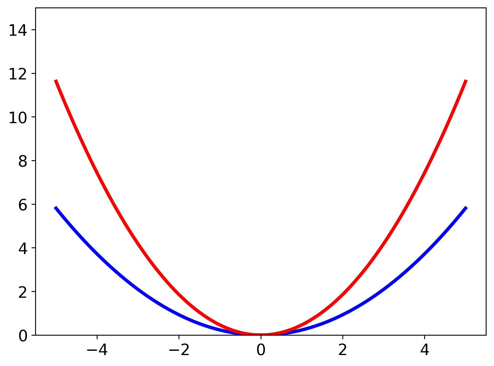

# Principles of Good Plotting

It's hard, exactly, to say what makes a plot "good" and we're definitely not the people to go to with your deep questions on the subject.
We are not visual designers, and we have no particular expertise in data presentation.
On the other hand, we have seen a lot of _bad_ plots and so here are our recommendations, with examples.

1. When comparing two things, unless wholly infeasible, make sure the plots have the same axes ranges
2. Lines should be in bold colors that are visually distinguishable to people with color-blindness
3. Plots should remain mostly comprehensible in black and white
4. When using LaTeX, make sure the fonts are consistent
5. The plot range and aspect ratio should be chosen so as to not distort the data.


### Examples

1 For these examples, let's compare two harmonic oscillator potentials. The only difference between the two
is that one of them will have a mass that is twice as large. When comparing them we want to set the range of energies to
be equal, otherwise it becomes harder to visually compare differences. So, for the following example we will set a limit
on the y axis so that the plots can be compared easily.
```console?lang=python&prompt=>>>
>>> import numpy as np
>>> import matplotlib.pyplot as plt

>>> m = 1728.26  # approximately the reduced mass of an OH stretch (in atomic units)
>>> k = 0.0164028  # an approximate frequency for an OH stretch (in atomic units)

>>> fig, axes = plt.subplots(1, 2) # sets up a figure with two side by side plots

>>> x = np.linspace(-5, 5, num=2000)
>>> data1 = 0.5*m*k**2*x**2  # equation for the potential energy of a harmonic oscillator
>>> data2 = 0.5*(m*2)*k**2*x**2

>>> axes[0].plot(x, data1)  # plotting data on the first plot (left plot)
>>> axes[1].plot(x, data2)  # plotting data on the second plot (right plot)

>>> axes[0].set_ylim(0, 15)
>>> axes[1].set_ylim(0, 15)

>>> plt.show() 

```

{:width="500px"}

In the above example, we manually set the y axis range for each plot. However, we could also use the `sharey` option in 
`plt.subplots` to have the same y-axis between the two plots and then we just have to set the y-axis range on one plot.

```console?lang=python&prompt=>>>
>>> fig, axes = plt.subplots(1, 2, sharey=True)

...  # everything the same as before except without 'axes[1].set_ylim(0, 15)'

>>> plt.show() 

```
{:width="500px"}


2 When making plots that are visually easy to interpret, you usually want colors that are not only vibrant, but those
that contrast each other. Typically if if pick colors on opposite sides of the [color wheel] (https://en.wikipedia.org/wiki/Color_wheel)
you should get colors to pop in a visually pleasing way. In the below example we will be making the two curves blue and red
and plotting them on the same plot.
```console?lang=python&prompt=>>>
>>> fig, ax = plt.subplots()
>>> ax.plot(x, data1, color='blue', linewidth=3)
>>> ax.plot(x, data2, color='red', linewidth=3)

>>> plt.show()
```

{:width="500px"}

We also increased the `linewidth` to make the lines more bold and easier to see. 

A note that the default orange color in `matplotlib` looks more gold than orange so be aware of that.


3 Sometimes, you want to also make your curves more visually distinct in case your plot gets printed in black and white, or
the colors on the projector you are using just aren't very clear. In that case, giving your data different shapes such as squares
and circles, making use of open shapes versus closed shapes, or having dotted lines and dashed lines becomes very helpful
in giving contrast between your data. In the following example, we will make one of our lines dotted.
```console?lang=python&prompt=>>>
>>> fig, ax = plt.subplots()
>>> ax.plot(x, data1, color='blue', linewidth=3)
>>> ax.plot(x, data2, color='red', linewidth=3, linestyle='dotted')

>>> plt.show()
```

{:width="500px"}

4 One thing that often gets overlooked is appropriate labels for the plot. That includes a y-axis label, x-axis label, 
and legend that have consistent fonts between each other and your equations in the rest of your work (whether that's a 
presentation or a paper). So, we will put something at the top of our script that should help with that.
```console?lang=python&prompt=>>>
>>> params = {'text.usetex': False,
    'mathtext.fontset': 'dejavusans',
    'font.size':14}
>>> plt.rcParams.update(params)
```

Now, the font will be sans serif font for all of the text on the figure, and the default font size will be 14 (this is 
because the default font size for `matplotlib` is pretty small). Now we will label our figure appropiately assuming that
we have some $\alpha$ term that we multiply the mass by in our harmonic oscillators.  

```console?lang=python&prompt=>>>
>>> fig, ax = plt.subplots()
>>> ax.plot(x, data1, color='blue', linewidth=3, label=r'$\alpha$ = 1') # this is a good example of using LaTeX with matplotlib
>>> ax.plot(x, data2, color='red', linewidth=3, linestyle='dotted', label=r'$\alpha$ = 2')

>>> axes.set_ylim(0, 15)

>>> axes.set_ylabel('Energy (Hartree)', fontsize=16)  # this is how you manually change the font size, incase it's too small
>>> axes.set_xlabel('x', fontsize=16)

>>> plt.legend()  # displays a legend for our figure

>>> plt.savefig('figure12.PNG', dpi=300, bbox_inches='tight')  # an example of saving our figure (discussed below)

>>> plt.show()
```

{:width="500px"}

Above we see an example of saving our figure for use later. A useful property is `bbox_inches='tight'` because it eliminates
excess white space around your figure. When that is done it is also helpful to set `dpi` to either 300 or 500 to keep a 
consistent figure size. 

Also, when dealing with LaTeX in your labels, if you want something to not be in italics `\rm{}` is going to be your friend.

5 Now we want to make sure that the ranges that we are plotting make sense according to the data that we want to present.
For example, lets assume that we want to see how the potentials compare in context with the ground state energy of these 
harmonic oscillators. In that case, looking at 10 Hartree isn't going to be useful as that energy is nowhere near the ground
state. What we'll do is convert things to cm$^{-1}$ and then set our viewing window to something a lot smaller.
```console?lang=python&prompt=>>>
>>> har2wave = 219474.6

>>> fig, ax = plt.subplots()
>>> ax.plot(x, data1*har2wave, color='blue', linewidth=3, label=r'$\alpha$ = 1')  # converting our energies 
>>> ax.plot(x, data2*har2wave, color='red', linewidth=3, linestyle='dotted', label=r'$\alpha$ = 2')

>>> axes.set_ylim(0, 5000)  # puts a cap on the energy of about 5000 cm-1, slightly smaller than the first 
                              excited state energy of our blue curve.
>>> axes.set_xlim(-0.5, 0.5)  # zoom in on our relevant x range

>>> axes.set_ylabel(r'Energy (cm$^{-1}$)', fontsize=16)  # don't forget to change the units on your y-axis label!!
>>> axes.set_xlabel('x', fontsize=16)

>>> plt.legend()

>>> plt.show()
```


Now we see a much more appropriate range for both the y and x-axis that we can compare.

<span class="text-muted">Previous:</span>
 [Getting Started with Matplotlib](OOPMatplotlib.md)
Got questions? Ask them on the [McCoy Group Stack Overflow](https://stackoverflow.com/c/mccoygroup/questions/ask)
{: .alert .alert-info}

---
[Edit on GitHub](https://github.com/McCoyGroup/References/edit/gh-pages/McCoy%20Group%20Code%20Academy/Plotting/TheGoodPlot.md)
