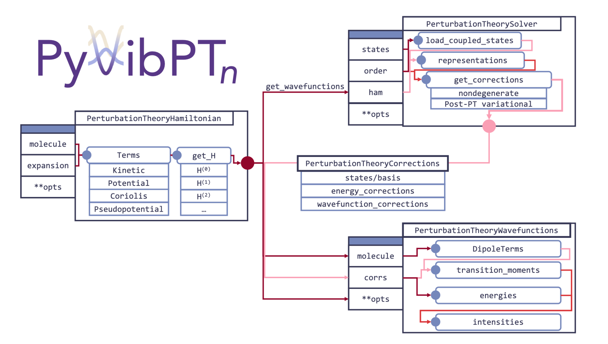

PyVibPTn has an extensive pile of documentation (some pages easier to read then others),
so consider this a roadmap of where to start or a TL;DR version (if you're hip like the youths).
The biggest thing to note at this stage is that the PyVibPTn package lives inside a larger one called _Psience_,
and for the purpose of documentation it is always refered to as _VPT2_.

If you're looking for download help try [here](https://mccoygroup.github.io/Psience/)

Here is a nice flow-chart of the code structure:
{width:600px}

But if that doesn't mean much to you, there is also this _pretty good_ [intro tutorial](https://mccoygroup.github.io/Psience/AnneDocs.html) to this package.
Or if you feel like jumping right in, [this](https://mccoygroup.github.io/Psience/Psience/VPT2.html) might be where you want to start.

P.S. you might notice this site looks a lot like the Psience documentation site... Does that give you a hint who our group website designer was?
{: .alert .alert-success}

---
[Edit on GitHub](https://github.com/McCoyGroup/References/edit/gh-pages/McCoy%20Group%20Code%20Academy/PyVibPackages/PyVibPTn.md)
