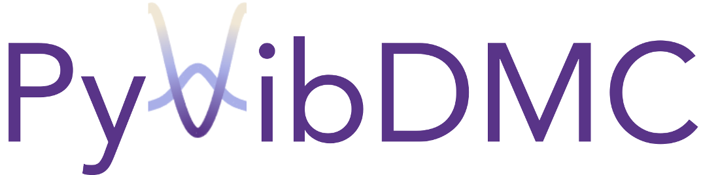
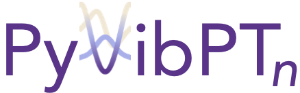

In the McCoy Group, _most_ of us work primarily with our own home-built code. 
But we recently had two group members (Dr. Ryan Dirisio and Dr. Mark Boyer), who wrote up big python packages for Diffusion Monte Carlo (PyVibDMC) and nth-order Vibrational Perturbation Theory (PyVibPTn). 
Now, we still believe the best way to learn a new method is to code it yourself, these two packages are filled with _tricky tricks_ and lots of handlers to make the code run faster, reliably, and hopefully bug-free.
Although there is always room for user error...

{:width="300px"}

Read about it:
* [Diffusion Monte Carlo approaches for studying nuclear quantum effects in fluxional molecules](https://wires.onlinelibrary.wiley.com/doi/abs/10.1002/wcms.1615)

Read about what we've done with it:
* [Fast Near Ab Initio Potential Energy Surfaces Using Machine Learning](https://pubs.acs.org/doi/full/10.1021/acs.jpca.2c02243)
* [Using Diffusion Monte Carlo Wave Functions to Analyze the Vibrational Spectra of H7O3+ and H9O4+](https://pubs.acs.org/doi/full/10.1021/acs.jpca.1c05025)
* [GPU-Accelerated Neural Network Potential Energy Surfaces for Diffusion Monte Carlo](https://pubs.acs.org/doi/full/10.1021/acs.jpca.1c03709)

Read about how you can use it!
* [McCode Academy PyVibDMC Intro](PyVibDMC.md)

{:width="300px"}

Read about it:
* [A Flexible Approach to Vibrational Perturbation Theory Using Sparse Matrix Elements](https://aip.scitation.org/doi/10.1063/5.0080892)

Read about what we've done with it:
* [Electronic and Mechanical Anharmonicities in the Vibrational Spectra of the H-bonded, Cryogenically Cooled X−HOCl (X=Cl, Br, I) Complexes: Characterization of the Strong Anionic H-bond to an Acidic OH Group](https://aip.scitation.org/doi/10.1063/5.0083078)
* [Preparation and Characterization of the Halogen-Bonding Motif in the Isolated Cl–·IOH Complex with Cryogenic Ion Vibrational Spectroscopy](https://pubs.acs.org/doi/10.1021/acs.jpclett.2c00218)
* with more _coming soon!_

Read about how you can use it!
* [McCode Academy PyVibPTn Intro](PyVibPTn.md)

---
[Edit on GitHub](https://github.com/McCoyGroup/References/edit/gh-pages/PyVibPackages/index.md)
