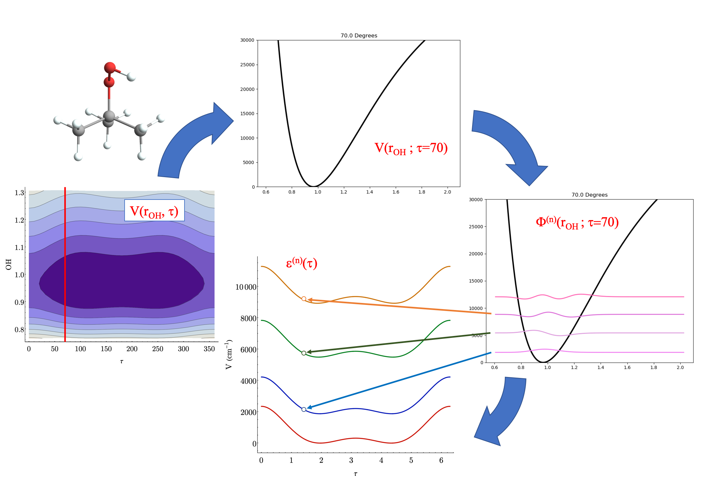
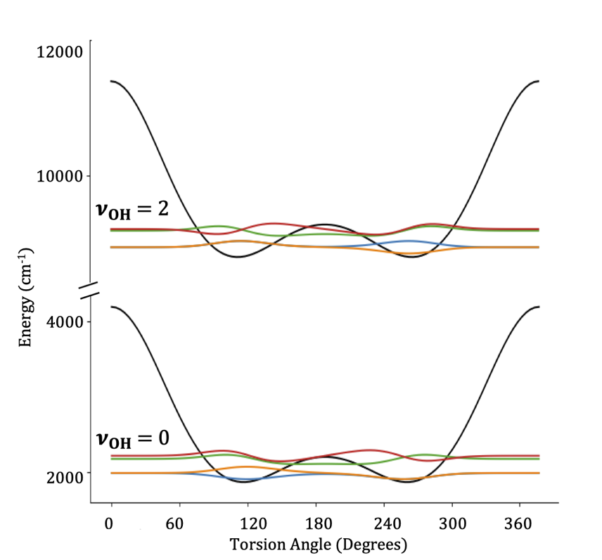

---
---
# Adiabatic Separations

A common thing we do when studying vibrations is to partition our set of vibrations into high-frequency and low-frequency modes.
This is the heart of an adiabatic separation, where we "adiabatically" (from Greek for _without crossing_) separate the high-frequency modes from the low-frequency ones.

Operationally, this means given a set of modes $Q = \{q_1, q_2, ...\}$, we split this into a high- and low-frequency subset as $Q = Q^{\mathrm{(HF)}} \cup Q^{\mathrm{(LF)}}$ and say

$$
\begin{align}
Q^{\mathrm{(HF)}} &= \{r_1, r_2, ...\} \\ 
Q^{\mathrm{(LF)}} & = \{\tau_1, \tau_2, ...\}
\end{align}
$$

and then we write our Hamiltonian as

$$
H(q_1, q_2, ...) = 
    T^{\mathrm{(HF)}}(r_1, r_2, ...) 
    + T^{\mathrm{(LF)}}(\tau_1, \tau_2, ...) + V(r_1, r_2, ..., \tau_1, \tau_2, ...)
$$

we then split this into two coupled lower-dimensional problems like

$$
\begin{align}
h^{\mathrm{(HF)}}(r_1, r_2, ...; \tau_1, \tau_2, ...) &= 
 T^{\mathrm{(HF)}}(r_1, r_2, ...) + V(r_1, r_2, ...; \tau_1, \tau_2, ...) \\
H^{\mathrm{(LF)},n}(\tau_1, \tau_2, ...) &= 
    T^{\mathrm{(LF)}}(\tau_1, \tau_2, ...) + \varepsilon^{n}(\tau_1, \tau_2, ...)
\end{align}
$$

where the $; \tau_1, \tau_2, ...$ in those definitions indicates that we treat those coordinates as fixed and $\varepsilon^{n}(\tau_1, \tau_2, ...)$ is the $n^{\mathrm{th}}$ energy from solving the Schrödinger equation for $h$.
Because it will become relevant later, if we write our total wave function as a product of a high-frequency mode wave function and low-frequency mode wave function

$$
\Psi_{n, m}(r_1, r_2, ..., \tau_1, \tau_2, ...) = 
    \Phi^{\mathrm{(HF)}}_{n}(r_1, r_2, ...; \tau_1, \tau_2, ...)
    \Phi^{\mathrm{(LF)}}_{m}(\tau_1, \tau_2, ...)
$$

we can also write $\varepsilon^{n}(\tau_1, \tau_2, ...)$ as

$$
\varepsilon^{n}(\tau_1, \tau_2, ...) = 
    \left\langle \Phi^{\mathrm{(HF)}}_{n} \right\lvert 
        h^{\mathrm{(HF)}}(r_1, r_2, ...; \tau_1, \tau_2, ...) 
        \left\rvert \Phi^{\mathrm{(HF)}}_{n} \right\rangle
$$

Practically, what an adiabatic separation does is provides us with a set of effective, _adiabatic_ potential energy surfaces which we can use for solving for wave functions and energies in the low-frequency modes, given some number of quanta of excitation in the high-frequency modes.

Pictorially, the process of obtaining the adiabatic surfaces (shown here for _t-butyl hydrogen peroxide_) looks something like this

{:width="100%" max-width:"1000px"}
_Steps as shown: 1 & 2) take a cut through the full potential surface for a fixed value of the low-frequency coordiante 3) solve for energies and wave functions in high-frequency modes 4) create surfaces for different levels of high-frequency excitation_

once we have these surfaces, we can solve for the wave functions in the low-frequency modes, giving us low-frequency wave functions parametrized by some quanta of high-frequency excitation

{:width="100%" max-width:"500px"}

## Benefits

There are two layers of benefits to applying an adiabatic separation. As an initial, somewhat lesser benefit, it can help us
save on computation time.
We know that high-frequency vibrations are (in general) better approximated by a harmonic potential than low-frequency ones, at 
least in the range of energies that we usually care about, and so we can often treat them with less computationally intensive 
methods.
Moreover, even if we use methods that require similar computational effort for our high- and low-frequency modes, if we're able
to split a high-dimensional problem into two lower-dimensional problems, we can get a dramatic benefit.
As an example, doing a 4D DVR with 60 DVR points in each dimension would require us to store a matrix with 
$60^{2*4} = 167961600000000$
elements.
By contrast, doing separating this into two 2D problems means the maximum matrix size we ever need to store is 
$60^{2*2} = 12960000$.
Then factoring in the non-linear [time complexity](https://en.wikipedia.org/wiki/Time_complexity) of getting eigenvalues and eigenvectors, even if we have to do many 2D calculations, we still get a performance boost over doing a single 4D calculation.
If dropping from 6D to coupled 3D problems, the performance boost will be even more significant.

Beyond the computational benefit, though, we also get a benefit in interpretation.
A common difficulty when working with high-dimensional wave functions is to extract the relevant information from them.
An adiabatic separation provides a very clean framework for analyzing such changes as it reduces the information in the high-dimensional space to a single energy and set of quantum numbers.

## Evaluation of Matrix Elements
...
[EDIT](https://github.com/McCoyGroup/References/edit/gh-pages/References/Basis%20Set%20Methods/AdiabaticSeparations.md)
{: .alert .alert-warning}

## Non-Adiabatic Coupling

Returning to our coupled Hamiltonians, we had

$$
\begin{align}
h^{\mathrm{(HF)}}(r_1, r_2, ...; \tau_1, \tau_2, ...) &= 
 T^{\mathrm{(HF)}}(r_1, r_2, ...) + V(r_1, r_2, ...; \tau_1, \tau_2, ...) \\
H^{\mathrm{(LF)},n}(\tau_1, \tau_2, ...) &= 
    T^{\mathrm{(LF)}}(\tau_1, \tau_2, ...) + \varepsilon^{n}(\tau_1, \tau_2, ...)
\end{align}
$$

where we wrote

$$
\varepsilon^{n}(\tau_1, \tau_2, ...) = 
    \left\langle \Phi^{\mathrm{(HF)}}_{n} \right\lvert 
        h^{\mathrm{(HF)}}(r_1, r_2, ...; \tau_1, \tau_2, ...) 
        \left\rvert \Phi^{\mathrm{(HF)}}_{n} \right\rangle
$$

formally, though, in the process we are actually taking the _entire_ Hamiltonian and "sandwiching" it between two of the wave functions coming from solving for $h^{n}$, i.e

$$
\begin{align}
H^{\mathrm{(LF)},n}(\tau_1, \tau_2, ...) = & 
    \left\langle \Phi^{\mathrm{(HF)}}_{n} \right\lvert
    T^{\mathrm{(HF)}}(r_1, r_2, ...) 
    + T^{\mathrm{(LF)}}(\tau_1, \tau_2, ...) + V(r_1, r_2, ..., \tau_1, \tau_2, ...)
    \left\rvert \Phi^{\mathrm{(HF)}}_{n} \right\rangle \\
     = & 
        \left\langle \Phi^{\mathrm{(HF)}}_{n} \right\lvert 
            T^{\mathrm{(HF)}}(r_1, r_2, ...)  
        \left\rvert \Phi^{\mathrm{(HF)}}_{n} \right\rangle + 
        \left\langle \Phi^{\mathrm{(HF)}}_{n} \right\lvert 
            T^{\mathrm{(LF)}}(\tau_1, \tau_2, ...)  
        \left\rvert \Phi^{\mathrm{(HF)}}_{n} \right\rangle + 
        \left\langle \Phi^{\mathrm{(HF)}}_{n} \right\lvert 
            V(r_1, r_2, ..., \tau_1, \tau_2, ...)
        \left\rvert \Phi^{\mathrm{(HF)}}_{n} \right\rangle
\end{align} 
$$

when looking at this, it becomes clear that we've assumed that $\Phi^{\mathrm{(HF)}}_{n}$ doesn't change significantly as vary $(\tau_1, \tau_2, ...)$, or more properly that

$$
\left\langle \Phi^{\mathrm{(HF)}}_{n}(\tau_1, \tau_2, ...)
    \vert \Phi^{\mathrm{(HF)}}_{m}(\tau_1^{\prime}, \tau_2^{\prime}, ...) \right\rangle = \delta_{n,m}
$$

This is often a quite good approximation (which is why we are able to use this method in the first place). Sometimes, though, it breaks down and we need to introduce non-adiabatic coupling.
This is done by properly evaluating the average between states.
If the representation of the kinetic energy is independent of the quantum number $n$ for the high-frequency motion, this just introduces an overlap in the high-frequency basis, i.e.

$$
\left\langle \Phi^{\mathrm{(HF)}}_{n}(\tau_1, \tau_2, ...) \right\lvert 
    H(q_1, q_2, ...)
\left\rvert \Phi^{\mathrm{(HF)}}_{m}(\tau_1^{\prime}, \tau_2^{\prime}, ...) \right\rangle
    = \\
    \left\langle \Phi^{\mathrm{(HF)}}_{n}(\tau_1, \tau_2, ...)
    \vert \Phi^{\mathrm{(HF)}}_{m}(\tau_1^{\prime}, \tau_2^{\prime}, ...) \right\rangle
     H^{\mathrm{(LF)},n}(\tau_1, \tau_2, ...) 
$$

Got questions? Ask them on the [McCoy Group Stack Overflow](https://stackoverflow.com/c/mccoygroup/questions/ask)
{: .alert .alert-info}

---

[Edit on GitHub](https://github.com/McCoyGroup/References/edit/gh-pages/References/Basis%20Set%20Methods/AdiabaticSeparations.md)