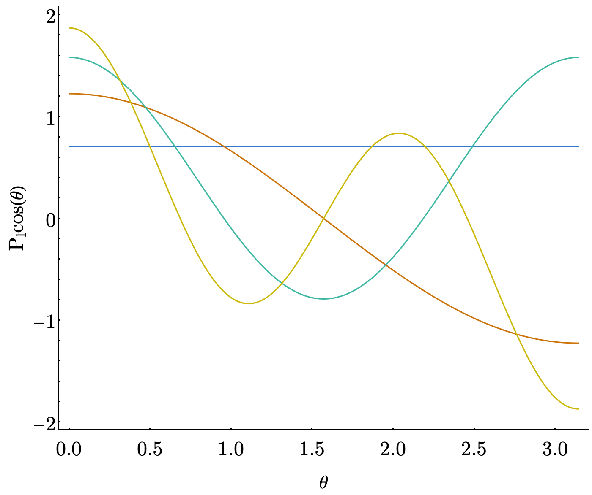
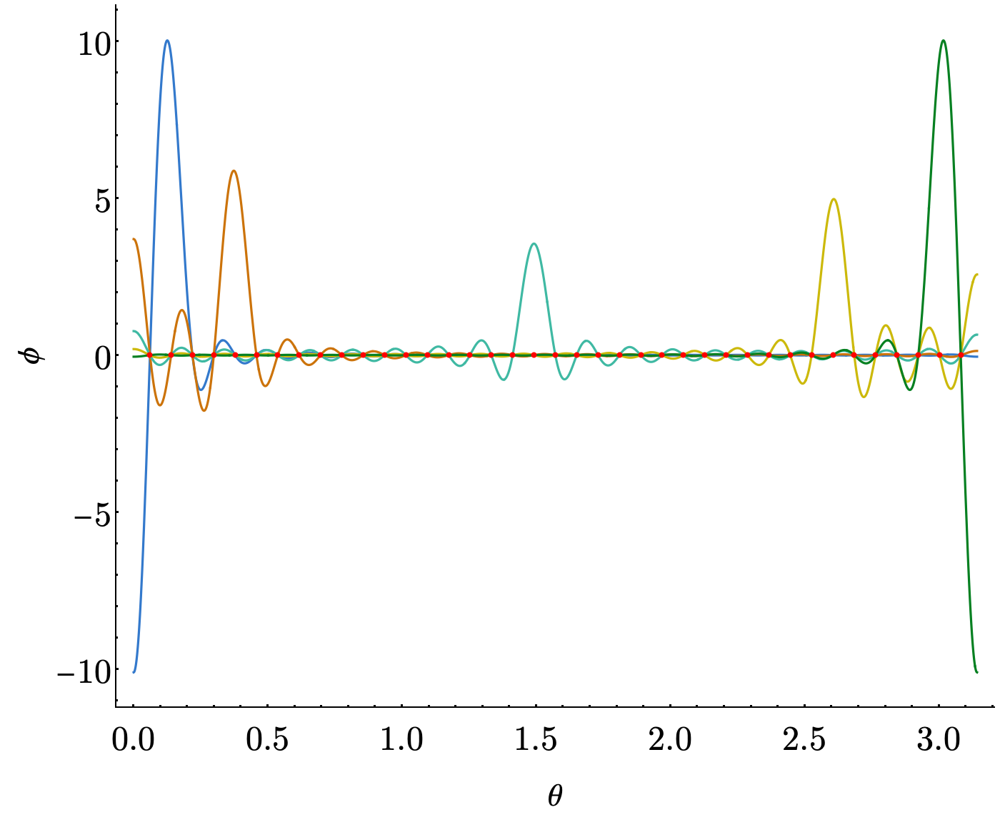
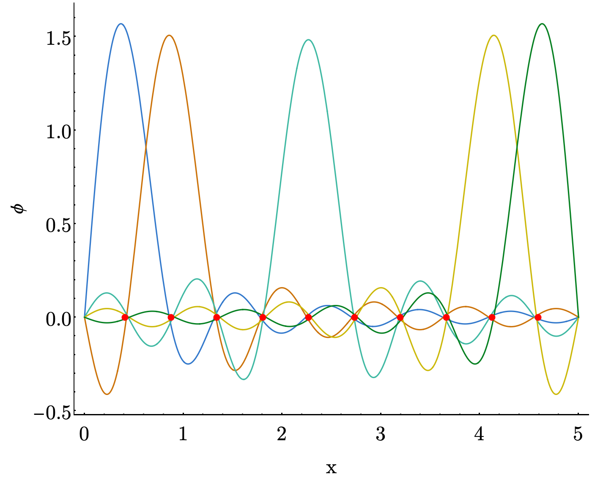

---
---
# Discrete Variable Representation

Discrete variable representation (DVR) is our first foray into what I like to think of as "higher-level" basis set methods.
Somewhat ironically, despite being "higher-level", DVR is usually easier to work with than any of the traditional methods.

At its heart, DVR is about finding the "best" basis for representing operators that are functions of just our coordinates (i.e. that don't involve things like derivatives of the wavefunction).
To do this, we actually _start_ with one of the bases we've talked about before, like the PIB, and build a representation for the coordinate operator.[1]
I.e. we set up the matrix

$$
X_{i,j} = \langle i|\hat{x}|j \rangle
$$

then we make use of one of the fundamentals of our flavor of linear algebra, which is that _diagonalization of an operator representation returns the best possible basis for that operator_.

Why do we care about having the best basis for coordinate-only operators?
Really just because the potential is this kind of operator and the potential is the hardest thing to deal with in a traditional basis set calculation.
By choosing the best basis for the potential, we can dramatically decrease the amount of work we need to do.

## Grid Points and the DVR Transformation

Diagonalization is something computers can do quickly and easily.
In general it means finding matrices $Q$ and $X^D$ such that $X^D$ is diagonal and

$$
X^D = Q^{-1}XQ
$$

$Q$ here is what we'll call our DVR transformation. It takes operators represented in our original basis and transforms them to the DVR basis.
How is the DVR basis the "best" basis for coordinate-only operators? Well $X^D$ is the representation of our coordinate operator in the basis defined by $Q$, and this representation is diagonal.
We can't really hope to do better than that.

These diagonal values are what we call our _grid points_ or _DVR points_.
It turns out that our DVR transformation does something very special, too.
Calling our DVR basis functions $\phi_i^{\text{(DVR)}}$ and our grid points $x_i$, we get that

$$
\phi_j^{\text{(DVR)}}(x_i) = f_i \delta_{i,j}
$$

where $f_i$ is just a real number.

This means that these DVR functions are localized around their grid points and zero at all the others.
That property will lead to some very useful results when setting up our Hamiltonian/using the resultant wavefunctions.

The DVR transformation allows us to switch smoothly between this discretized representation and the continuous representation from our original basis.
Say we've got a simple representation for some operator $M$ in our original basis. We can do a _change of basis_ to put this representation into the DVR basis by

$$
M^{\text{(DVR)}} = Q^{-1}MQ
$$

We can also go _backwards_ by switching the order of multiplications.
This allows us to reap the benefits of both representations, should that be something we find useful.

## Choice of Original Basis

The constraints of our problem strongly determine what types of bases are appropriate, which in turn determines what flavor of DVR we use.
We're not gonna get into every possible, reasonable choice, but ~1993 Szalay published [a paper](https://aip.scitation.org/doi/abs/10.1063/1.465258) with a bunch of the different flavors worked out.
For instance, in problems where we have an angle that can only range from $[0, \pi]$, the Legendre polynomials ($P_l$) are a good choice to satisfy that condition.
They look like

{:width="650px"}

We play an interesting trick, here, where instead of using $\hat{x}$ as our coordinate operator, we use $cos(\theta)$ instead.
This greatly simplifies the problem of evaluating the coordinate matrix elements.
We also need to account for an extra "volume element" in our integrals, i.e. our coordinate operator matrix looks like

$$
X_{i,j}=\langle i|\cos(\theta)|j\rangle= \int_{0}^{\pi} P_i(\cos(\theta))\cos(\theta)P_j(\cos(\theta))\sin(\theta) d \theta
$$

Once we do this, we get a clean representation as

$$
X_{i,j} = \begin{cases}
\sqrt{\frac{i^2}{(2 i + 1)(2 i - 1)}} & j = i+1 \\
\sqrt{\frac{j^2}{(2 j + 1)(2 j - 1)}} & i = j+1 \\
0 & \text{else}
\end{cases}
$$

and our basis functions now look like

{:width="650px"}

For periodic problems on a $[0, 2\pi]$ range, there are different types of DVRs out there, like [this one](https://aip.scitation.org/doi/pdf/10.1063/1.1673259) by Meyer.

## Colbert-Miller DVR (Particle in an Infinite Box)

One particular flavor or DVR that we like to use is the one described by [Colbert and Miller](https://aip.scitation.org/doi/10.1063/1.462100) in the early 1990s.
There are three reasons we like this one:

1. There are analytic forms for the kinetic energy
2. The grid points are evenly spaced
3. It's appropriate for most non-periodic vibrations

Their approach actually differs from the one we detailed here, although the core idea is the same.
The effect is to start with particle in a box basis functions, apply the type of DVR transformation that we describe here, then take the limit as the box and number of basis functions become infinite.

The end result of this is that their DVR basis functions are shifted $\frac{\sin(\theta)}{\theta}$ functions, which look like

{:width="650px"}

We recommend reading Appendix A of Colbert and Miller's paper and starting with the (- $inf$, $inf$) interval! (aka your kinetic energy is described by Equation A7) But note you will need some potential function to run this all the way through, seems like the perfect place for a harmonic oscillator!

Got questions? Ask them on the [McCoy Group Stack Overflow](https://stackoverflow.com/c/mccoygroup/questions/ask)
{: .alert .alert-info}

## Sample Applications

There are tons of applications for DVR out there.
It's one the main tools that we keep in our toolbox.
To get you started, we've got an exercise on writing your first [Colbert & Miller-style DVR](../../McCoy%20Group%20Code%20%Academy/Exercises).
Check it out.

---
<a id="#fn1">&nbsp;</a> Nothing requires this operator to just be something like $\hat{x}$. In a curvilinear system, we can just as easily use $cos(\theta)$ as $\theta$, should that be a more convenient choice.

[1]:#fn1

[Edit on GitHub](https://github.com/McCoyGroup/References/edit/gh-pages/References/Basis%20Set%20Methods/BasicDVR.md)
