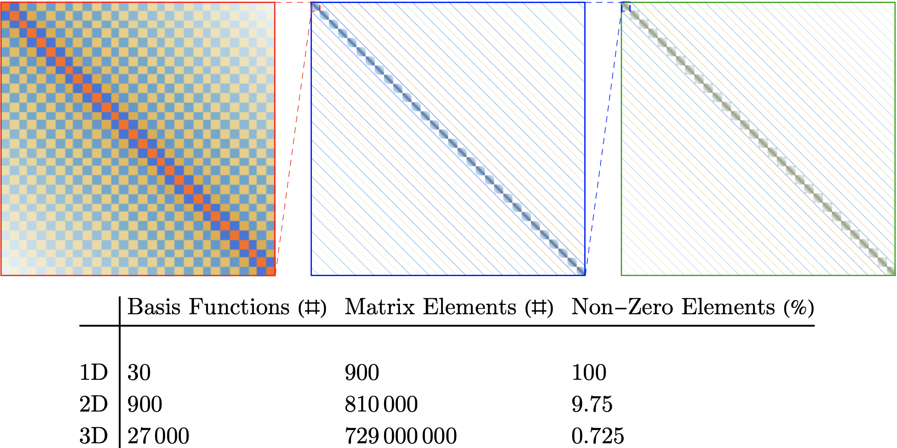

---
---
# Multidimensional DVR

Just as [one-dimensional discrete variable representation](BasicDVR.md) is a simple application of
basis set approaches with a discretized basis, multidimensional DVR is just an application of a product basis
from 1D DVR bases.

This means our basis functions will look like

$$
\phi_{n_1, n_2, ...}(x_1, x_2, ...) = \prod_{i} \phi^{(1D)}_{n_i}(x_i)
$$

where each term, $\phi^{(DVR)}_{n_i}(x_i)$, will show the localization to a single grid point that we discussed
before.

Then given a Hamiltonian that can be written like

$$
H(q_1, q_2, ...) = \sum_{i} \frac{p_{q_i}^2}{2 m_{q_i}} + V(q_1, q_2, ...)
$$

our Hamiltonian representation can be built like

$$
\left\langle \phi_{n_1, n_2, ...} \right\lvert H(q_1, q_2, ...) \left\rvert \phi_{m_1, m_2, ...} \right\rangle  = 
    \left\langle \phi_{n_1, n_2, ...} \right\lvert \sum_{i} \frac{p_{q_i}^2}{2 m_{q_i}} \left\rvert \phi_{m_1, m_2, ...} \right\rangle
    + \left\langle \phi_{n_1, n_2, ...} \right\lvert V(q_1, q_2, ...) \left\rvert \phi_{m_1, m_2, ...} \right\rangle
$$

and by expanding out the product basis terms we get

$$
\left\langle \phi_{n_1, n_2, ...} \right\lvert H(q_1, q_2, ...) \left\rvert \phi_{m_1, m_2, ...} \right\rangle  = 
    \sum_{i} \left\langle \phi_{n_i} \right\lvert  \frac{p_{q_i}^2}{2 m_{q_i}} \left\rvert \phi_{m_i} \right\rangle \prod_{j \neq i} \delta_{n_j, m_j}
    +  V(q_1, q_2, ...) \prod_{i} \delta_{n_i, m_i}
$$

The potential term, as in the 1D case, will just yield a perfectly diagonal representation where the potential is evaluated at the grid points, which in the
multidimensional case will be a [Cartesian product](https://en.wikipedia.org/wiki/Cartesian_product) of the 1D grid points.

The kinetic term is also pretty straight forward, being built from what some people call the [Kroenecker sum](https://mathworld.wolfram.com/KroneckerSum.html) of the 1D kinetic representations.

Both of these components lend themselves very nicely to [sparse matrix methods](https://docs.scipy.org/doc/scipy/reference/sparse.html), 
which can dramatically reduce the amount of memory used in a calculation and speed up the process of obtaining wave functions and energies.

Here's a plot of how these representations look and how sparse they become as the dimension of the problem scales up

{:max-width="700px" width="100%"}

## Adding Kinetic Coupling

This form of Hamiltonian is a good starting point for many problems.
Unfortunately, we aren't always able to eliminate kinetic coupling, 

As an example of that, let's consider that we have a Hamiltonian that looks like

$$
H(q_1, q_2, ...) = \sum_{i} \frac{p_{q_i}^2}{2 m_{q_i}} + \sum{i,j} \frac{p_{q_i} p_{q_j}}{g_{q_i, q_j}} + V(q_1, q_2, ...)
$$

when we get our representations, we'll pick up an extra term

$$
\left\langle \phi_{n_1, n_2, ...} \right\lvert \sum{i,j} \frac{p_{q_i} p_{q_j}}{g_{q_i, j}} \left\rvert \phi_{m_1, m_2, ...} \right\rangle  = 
    \sum{i,j} \sum_{i} \left\langle \phi_{n_i} \right\lvert  \frac{p_{q_i} p_{q_j}}{g_{q_i, q_j}} \left\rvert \phi_{m_i} \right\rangle \prod_{k \neq i \neq k} \delta_{n_k, m_k}
$$

and now we'll need to build 1D representations of $p_{q_i}$ and $p_{q_j}$ so that we can build a represent of $p_{q_i} p_{q_j}$ like

$$
\textbf{p}_{q_i} \textbf{p}_{q_j} = \textbf{p}_{q_i} \otimes \textbf{p}_{q_j}
$$

and then this will need to be scaled by the term $g_{q_i, q_j}$.

Finally, this coupling representation can be included in the total representation through the same Kroenecker sum approach as before.

Unfortunately, this is more system-specific than the uncoupled version, and so if presented with this kind of system one will need to 
think carefully about how to best deal with it.
When possible, look for ways to eliminate the kinetic coupling, as that will allow sparse methods to be more efficient and decrease the number
of places where bugs can enter the calculations.

Got questions? Ask them on the [McCoy Group Stack Overflow](https://stackoverflow.com/c/mccoygroup/questions/ask)
{: .alert .alert-info}

---

[Edit on GitHub](https://github.com/McCoyGroup/References/edit/gh-pages/References/Basis%20Set%20Methods/MultidimDVR.md)