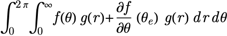
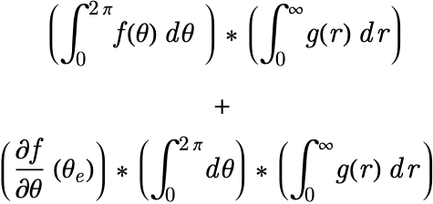

# Reading Math

This is the section where I'm hoping to convince you that the math we work with is really not so bad and that you can do it too.
So pls be convinced.
We're going to treat mathematical expressions the exact same way we treated our code, that is we'll say

> A math expression...
* Takes a set of inputs
* Applies a series of transformations to the data to return an output
* Tells a "story"

What's pretty convenient is these expressions are inherently hierarchical, so if we're given the expression



we can restructure this like




then we can replace the expressions with a symbolic equivalent

```lang-none
Plus[
  Times[
    Integrate[f[Theta], {Theta, 0, 2Pi}], 
    Integrate[g[r], {r, 0, Infinity}]
    ],
  Times[
   Derivative[f[Theta]][Theta_e]
   Integrate[1, {Theta, 0, 2Pi}], 
   Integrate[g[r], {r, 0, Infinity}]
   ]
  ]
```

and hopefully the hierarchy of statements is pretty clear there. 

What's note worthy is that _all_ mathematical expressions can be represented like this


Next: [Translating Math Into Code](TranslatingMathIntoCode.md)

---


[Edit on GitHub](https://github.com/McCoyGroup/References/edit/gh-pages/References/Intro%20To%20Quantum/ReadingMath.md)