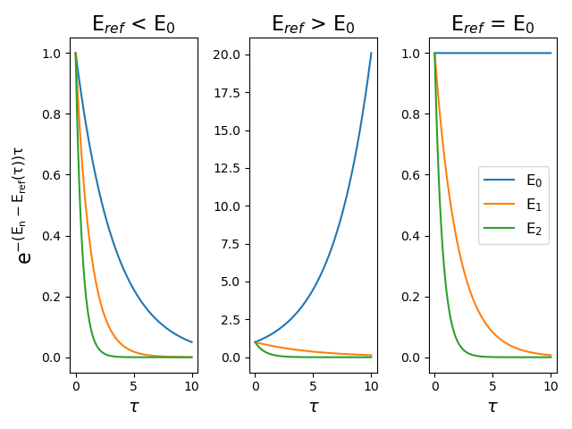
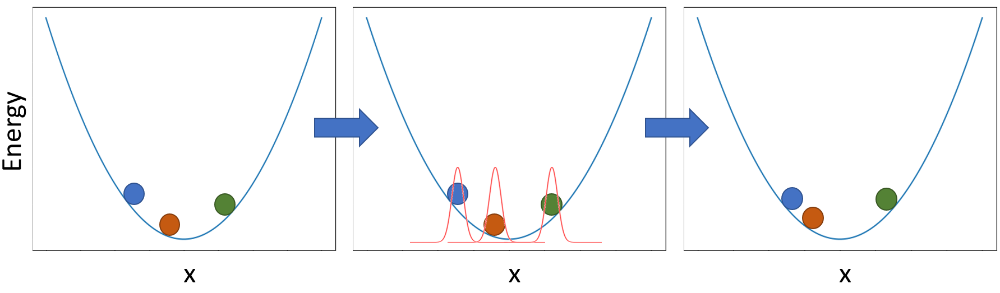
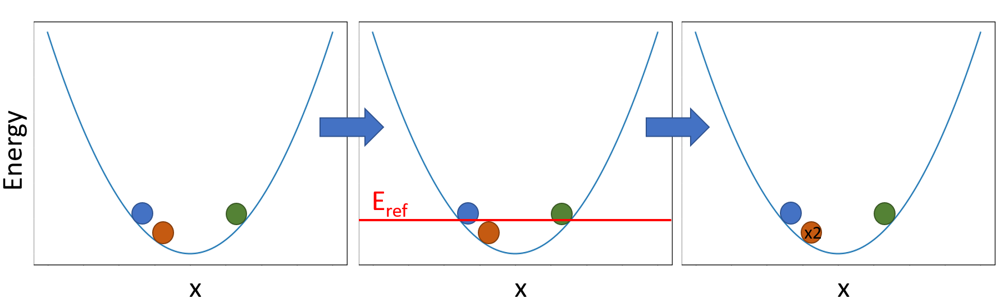

# Basic Diffusion Monte Carlo

### Brief Overview of the Theory

As is shown in [Anderson et. al.](https://aip.scitation.org/doi/10.1063/1.432868) and is discussed
in [Suhm and Watts](https://doi.org/10.1016/0370-1573(91)90136-A), the ground state solution to the
TDSE is solved in this method first through a Wick rotation into imaginary time. The energy is shifted
by some reference energy (This is similar to shifting our energy to redefine zero). It is then solved for
discrete time steps as to achieve the following solution:

$$
\Psi(x, \tau + \Delta\tau) \approx e^{-(\hat{V} - E_{ref})\Delta\tau}e^{-\hat{T}\Delta\tau}\Psi(x, \tau)
$$

When we operate with our kinetic operator and our potential operator, we've stepped forward in time! The time-dependent wave function
can always be written as a linear combination of eigenstates of the Hamiltonian multiplied by a time-dependent part like the following:

$$
\Psi(x, \tau) = \sum_n c_n (\tau = 0)\psi_n(x)e^{-(E_n-E_{ref}(\tau))\tau}
$$

When we take the long 
limit, the exponent in the exponential term becomes a large negative number,
causing most terms to go to 0. The ground state will decay the slowest.

$$
\lim_{\tau \to \infty} \Psi(x, \tau) \approx c_0(\tau=0) \psi_0(x)e^{-(E_0-E_{ref})\tau}
$$

This exponential decay can be seen in the following figure for different values of Eref.

We see that when Eref is less than E0, all states decay to zero, but the ground state
decays the slowest. When Eref is greater than E0, the contribution of 
the ground state dominates. During the course of the simulation, when the amplitude of the ground state becomes constant,
Eref = E0, and the n=0 term's exponential goes to 1 (as the exponent
will go to 0) meaning that at long τ we will get the ground state solution! :)

### The Algorithm

Now let's talk about how we can actually implement this to obtain our ground state solution.
On a simple level, this algorithm boils down to four steps.

* Displace the coordinates of your walkers
* Calculate the potential energy of your walkers
* Birth and death of the walkers
* Calculate Eref

These steps are repeated until the end of the simulation. The exception is for the first step
where the Eref has not been calculated yet, which is essential in the birth and death step.
So, for the first step, what is usually done is the potential energy of the walkers is calculated, followed
by a calculation of Eref, then the four steps are looped until the end of the simulation.

So, for the first step where we displace the coordinates, this comes from the action of the kinetic
energy operator operating on our wave function. This is a good exercise that will left to the reader
where the result of operating on our localized function is that we get a gaussian distribution with width equal
to  (Δτ/m)1/2 where m is the mass associated with our system (all in atomic units). If we were modeling an OH stretch, the mass would be the reduced mass. How this plays out algorithmically is that we will displace our walkers
randomly according to this Gaussian distribution. This can be shown in the following figure:

In the first panel we have a set of three walkers on our potential energy surface. Then according to the gaussian
distribution discussed above, the walkers are moved randomly in the second and third panel.

The next step is using those displaced coordinates to evaluate the average potential energy of our 
ensemble. The potential depends on our system and is a function you will be providing the simulation. The example
above is a simple harmonic oscillator.

The third step we are comparing the potential energy of our walkers to the value of Eref from
the previous step. If the energy is larger than this value, there is a probability that this walker will be 
removed from the simulation. If the energy is lower than this value, there is a probability that this walker will
spawn replicates into our simulation. To do this, we calculate the following exponential for each walker:

$$
e^{-(V(x_j)-E_{ref})\Delta\tau}
$$

Following the procedure outlined in Anne's paper [here](https://doi.org/10.1080/01442350600679347), for each walker we will
take the integer value of this exponential and make that many clones into a new array. Then the fractional part is taken
as a probability to create one extra copy of that walker. For example, if this exponential value for one walker is 4.7, 
4 identical copies of that walker get put into the new array and that is a 70% chance for a fifth. If this exponential 
is 0.4, then there is only a 40% chance that the walker will stick around. This can be shown in the following figure:

We see that the walkers are compared to the value of Eref for this set of walkers. Since the orange walker was 
below Eref, it had a chance to make a clone of itself and it did, making two replicates of the orange walker for
the next step in the simulation.

The last step is calculating Eref. This is done with the following equation:

$$
E_{ref}(\tau) = \bar{V}(\tau) - \alpha \frac{N(\tau) - N(\tau_0)}{N(\tau_0)}
$$

Where the first term is the average potential energy of our ensemble and the second term ensure
that the number of walkers remain roughly constant. That α term is equal to 1/(2Δτ) and the N is equal
to the number of walkers.

All of this is then repeated until the end of the simulation where you end up with an array of Eref values. To
obtain our zero point energy for the system, we will take an imaginary-time average of Eref from an equilibrated
point in our simulation until the end of the simulation. This can be shown in the following figure where the orange box represents
the values of Eref that will be averaged over.

### Differences Between Discrete and Continuous Weighting
The biggest difference between these two types of simulations is that discrete weighting has a fluctuating population where
the weight of each walker is 1, while in continuous weighting the population is held constant while the weight of each walker is allowed
to fluctuate. How this works in our algorithm is that for the birth and death step, the probability for a walker's birth and death becomes equal
to the weight that walker contributes to the total ensemble. This means that instead of a walker replicating itself when it is in favorable regions
of the potential, the weight of the walker increases. One consequence with this method is that a walker could stay in a favorable region
of the potential and have a weight so large that it dominates the ensemble. In order to mitigate this, we replace walkers whose weight falls
below a certain threshold with a replicate of the highest weight walker. These two walkers' weights are then cut in half.

The second difference is that Eref is calculated using the sum of the weights of the walkers instead of the number of walkers.
This is technically the same equation since in the discrete weighting case, the weight of each walker is 1, so the sum of the weights of the walkers
is equal to the number of walkers.

[Link to Exercises](https://mccoygroup.github.io/References/McCoy%20Group%20Code%20Academy/Exercises/)

Got questions? Ask them on the [McCoy Group Stack Overflow](https://stackoverflow.com/c/mccoygroup/questions/ask)
{: .alert .alert-info}

---

[Edit on GitHub](https://github.com/McCoyGroup/References/edit/gh-pages/References/Monte%20Carlo%20Methods/DMC.md)
