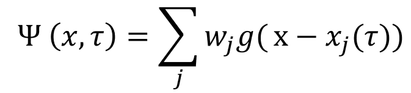
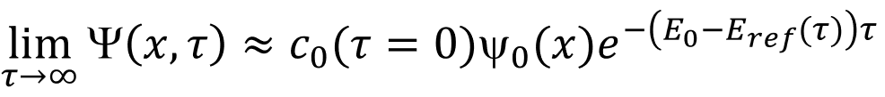

# Basic Diffusion Monte Carlo

### Introduction
Diffusion Monte Carlo (DMC) is a way to solve the time-dependent Schrodinger equation (TDSE)
 using Monte Carlo sampling of a potential energy surface. The implementation that we use in the group is
 based on Anderson et. al. in [this paper](https://aip.scitation.org/doi/10.1063/1.432868). At the end of the simulation we will have a wavefunction
 and a zero point vibrational energy.  The way we will do this is by representing our
 wavefunciton as an ensemble of localized functions, or "Walkers", each of which represents a configuration
 of the molecule/system of interest. One can think of these as an ensemble of localized functions, taking up one point of 3N
 configuration space as so:

 

 We discretize time into "time steps", and we will displace each walker at every time step, the displacement is based on
 a normal distribution (Gaussian), which is parametrized by the mass and the step size. We can think about it in terms of
 moving an object. The bigger the object, the harder it is to move and the less time we have to move object, the shorter
 the distance we can move it will be.

 We will need to check the energy of each walker after it makes its step to see if it was an energetically favorable
 or unfavorable move.  If it was too unfavorable, the walker might be removed from the simulation.  If it was very
 favorable, the walker may be replicated.

### Brief Overview of the Theory

As is shown in [Anderson et. al.](https://aip.scitation.org/doi/10.1063/1.432868) and is discussed
in [Suhm and Watts](https://doi.org/10.1016/0370-1573(91)90136-A), the ground state solution to the
TDSE is solved in this method first through a Wick rotation into imaginary time. The energy is shifted  
by some reference energy (This is similar to shifting our energy to redefine zero). It is then solved for
discrete time steps as to achieve the following solution:

