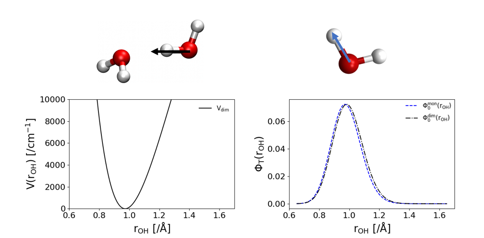
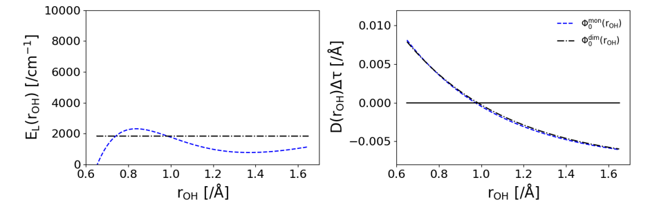

# Importance Sampling/Guided Diffusion Monte Carlo

### Basic Overview of the Theory
Importance sampling or guided DMC, as is often referenced in [our](https://pubs.acs.org/doi/10.1021/acs.jpca.0c07181) [papers](https://pubs.acs.org/doi/full/10.1021/acs.jpca.0c05686), is a method we use to reduce the needed ensemble size in our simulations in order to obtain zero-point energies and ground state wave functions with far fewer walkers. This gets increasingly important as we move to systems with more degrees of freedom because with larger system sizes, we need more and more walkers to accurately describe it. With more walkers, we need to evaluate the potential energy of the system even more, and that becomes restrictively expensive. Therefore, we use this method to combat that increase in system size while still obtaining accurate results so that we can tackle larger systems with DMC. A detailed review of this method is presented in [this paper](https://wires.onlinelibrary.wiley.com/doi/abs/10.1002/wcms.1615). Due to restricted access, please ask a group member for access if you are interested in reading more. 

The method is based upon provided a "good guess" to some of the degrees of freedom within your system so that the simulation doesn't have to sample those vibrations as much. What this means is that we are providing a guiding function, sometimes called a trial wave function, to the simulation to help guide walkers to more probable positions based on the provided guiding function. For example, in the following figure we have a system for a 1-d vibration of the Hydrogen-bonded OH stretch in water dimer. The potential for this system is on the left and the wave function is on the right in black. A good guess for this system would be the 1-d OH stretch in an isolated water momomer which is shown in blue on the right. 

{:width=500px}

When using this guiding function, instead of sampling $\Psi$ like in the [basic diffusion monte carlo algorithm](https://mccoygroup.github.io/References/References/Monte%20Carlo%20Methods/DMC.html), the simulation will sample $f = \Psi*\Phi_T$ where $\Phi_T$ is our guiding function or trial wave function. This changes the imaginary-time time-dependent Schrodinger Equation from, 

$$
\frac{d\Psi}{d\tau} =\sum_{j=1}^{n_\mathrm{atoms}} \left [\frac{\hbar^2}{2m_j}\nabla^2_j - \left (V(\mathbf{x})-E_\mathrm{ref}\right )\right ]\Psi(\mathbf{x})
$$

to the following,

$$
\frac{df}{d\tau} =\sum_{j=1}^{n_\mathrm{atoms}} \left [\frac{\hbar^2}{2m_j}\nabla^2_j - \left (E_\mathrm{L}(\mathbf{x})-E_\mathrm{ref}\right )\right ]f(\mathbf{x})\nonumber 
       -\sum_{j=1}^{n_\mathrm{atom}}\vec\nabla_j\cdot \left (f(\mathbf{x})\vec{D}_j(\mathbf{x})\right )
$$

We can see two new terms are added to the equation. These are $E_L$ and $D$ which are refered to as the local energy and the drift term respectively. These terms are calculated as follows,

$$
E_\mathrm{L} = \frac{\hat{H}\Phi_\mathrm{T}}{\Phi_\mathrm{T}}
$$

$$
\vec{D}_ j(\mathbf{x})=\frac{\hbar^2}{m_j}\ \frac{1}{\Phi_\mathrm{T}(\mathbf{x})}\ \vec \nabla_j \Phi_\mathrm{T}(\mathbf{x})
$$

The effect that these terms have can be shown in the following figure. The local energy replaces the potential energy evaluation in the simulation. As is shown below, this has the effect of reducing the dpendence that this coordinate has on the energy of the system significantly. When using the black wave function, which is the eigen state of the system, the local energy is constant because it is equal to the ground state energy of the system. When using the blue wave function, the wave function from an isolated water monomer, the local energy isn't constant but is less dependent on the coordinate that the potential energy. The drift term has the effect of guiding walkers toward more probable positions of the guiding function. In the right plot, the drift term is positive when $r_{OH}$ is too short and negative when $r_{OH}$ is too long. 

{:width=500px}

Due to the drift term, a final piece needs to be added so that each step in the simulation obeys microscopic reversibility. We compare the probability of a walker moving from $x$ to $x'$ to the probability of a walker moving from $x'$ to $x$. This relative probability is calculated with the following formula.

$$
{\cal{P}}_ j = \frac{P\left (\mathbf{x}^\prime_ j\rightarrow \mathbf{x}_ j\right )}{P\left (\mathbf{x}_ j\rightarrow \mathbf{x}_ j^\prime\right )}= \frac{\Phi^2_ \mathrm{T}(\mathbf{x}^\prime_ j)}{\Phi^2_ \mathrm{T}(\mathbf{x}_ j)}
        \ \prod_{k=1}^N\exp \left [-\left (\left |\mathbf{\delta}^\prime_ {k,j}\right |^2-\left |\mathbf{\delta}_ {k,j}\right |^2\right )/2\sigma_ k^2\right ]
$$

$\delta$ is the shift that is applied to the walkers' positions from the Gaussian probability distribution described [before](https://mccoygroup.github.io/References/References/Monte%20Carlo%20Methods/DMC.html) and $\sigma$ is the width of that Guassian distribution that $\delta$ is sampled from.

### How You Can Use Guided DMC
We've implemented the capability to perform Guided DMC with PyVibDMC so that the only thing that is neccessary to provide is a function that calculates the guiding function for each of your walkers. This is outlined on [this](https://pyvibdmc.readthedocs.io/en/latest/imp_samp.html) page of the documentation for PyVibDMC and has an example that you can follow for a 1-d harmonic oscillator and a water monomer. 

When just supplying a function for the guiding function, the importance sampling handler will calculate all the first and second derivatives that are neccessary for the drift term and local energy through a full finite difference. This can start to get expensive for larger systems, so if you can provide functions that provide the first and second derivatives of your guiding function with respect to cartesian coordinates, that is preferable. However, remember to follow your chain rule all the way through when calculating those terms ;) There is a helper class on that same page of the PyVibDMC documentation that can help with this!

Got questions? Ask them on the [McCoy Group Stack Overflow](https://stackoverflow.com/c/mccoygroup/questions/ask)
{: .alert .alert-info}

---

[Edit on GitHub](https://github.com/McCoyGroup/References/edit/gh-pages/References/Monte%20Carlo%20Methods/ImpSamp.md)
