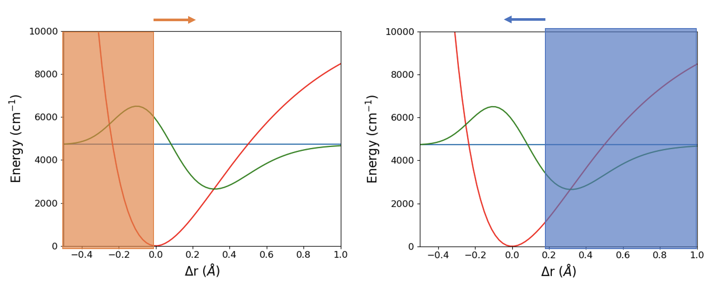

# Fixed-node method

### Theory and Overview
Fixed-node method is one way to get the excited state information from the ground state method. In this case, we will focus on the Fixed-node DMC. The idea for the fixed-node method is that if we have some arbitrary potential:

If we know where the node of the excited state function beforehand, we can cover one side of the potential, and the ground state function of the half potential would be the first excited state function of the whole potential. The reason is because if we take a look at the Schrodinger's equation $\frac{H\Psi(x)}{\Psi(x)} = E(x)$. The equation only evolves one position (x) at the time, so it is locally satisfied. So, with DMC, we can get the excited state energy and the excited state wavefunction. We can simulate the half potential with the infinite potential wall for the other half of the potenital. 

### Finding node position
The only thing we need is the location of the node, the way we get it is by running two adiabatic DMC calculations. On one calculation, we move the potential wall from the right to the left, and on the other calculation, we move the potenital wall from the left to the right. 

We can then use the energy from the calculations to find the node location, since at the correct node position, the energy for the two runs should be the same, we can plot the energy vs the node location for the two runs, fit it, and then find where the fitted lines crossed.

### Recrossing
One last problem on fixed-node DMC is that in DMC, we work with discrete time step, and so there is a chance that in one time step, the walker crosses the node and recrosses back. If we were to have a perfect simulation where the time step is infinitesimal, we would have killed that walker. The way we deal with this problem is that the probability of the recrossing can be calculated according to [Anderson et. al.](https://aip.scitation.org/doi/10.1063/1.432868) to be $\exp(-\frac{2x'x''m}{\Delta\tau})$ where $x'$ and $x''$ are the initial and final position, $\Delta\tau$ is the time step interval, and $m$ is the mass associated with our system. So, we kill each walker with that probability to simulate the recrossing situation.

### Working with PyVibDMC
In most situation, you will be working with PyVibDMC to run a fixed-node DMC, and PyVibDMC already has a function for running fixed-node DMC. Here is what you need to add to the ground state PyVibDMC calculation:
- a function for distance calculation
- a function or a number for g matrix element (1/mass of the system)
- a line in DMC_Sim with the following
`fixed_node = {"function":xxx,"g_matrix":yyy}` Replace the `xxx` and `yyy` with your distance and g matrix function.

###

Got questions? Ask them on the [McCoy Group Stack Overflow](https://stackoverflow.com/c/mccoygroup/questions/ask).
{: .alert .alert-info}

---
[Edit on GitHub](https://github.com/McCoyGroup/References/edit/gh-pages/References/McCoy%20Group%20Code%20Academy/<Path/To/Page.md>)
