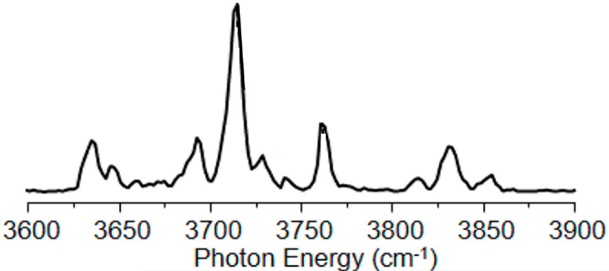
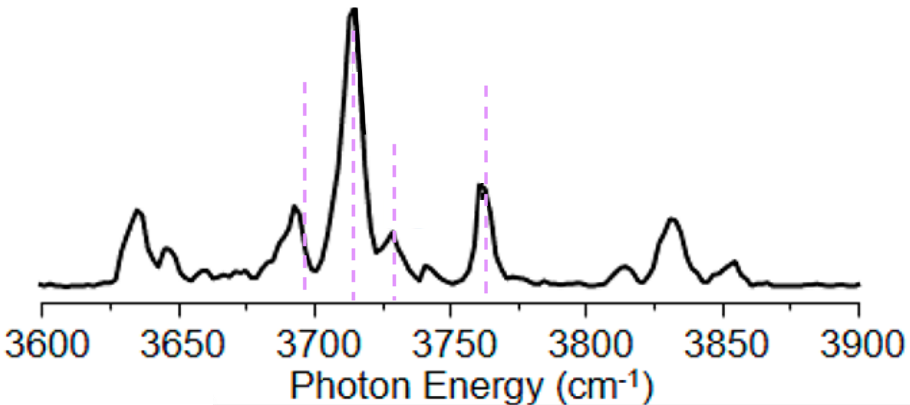
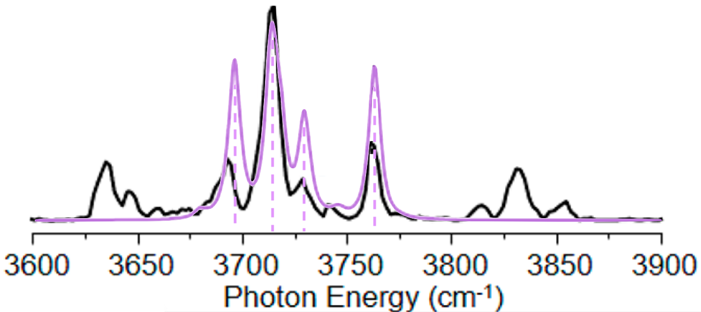
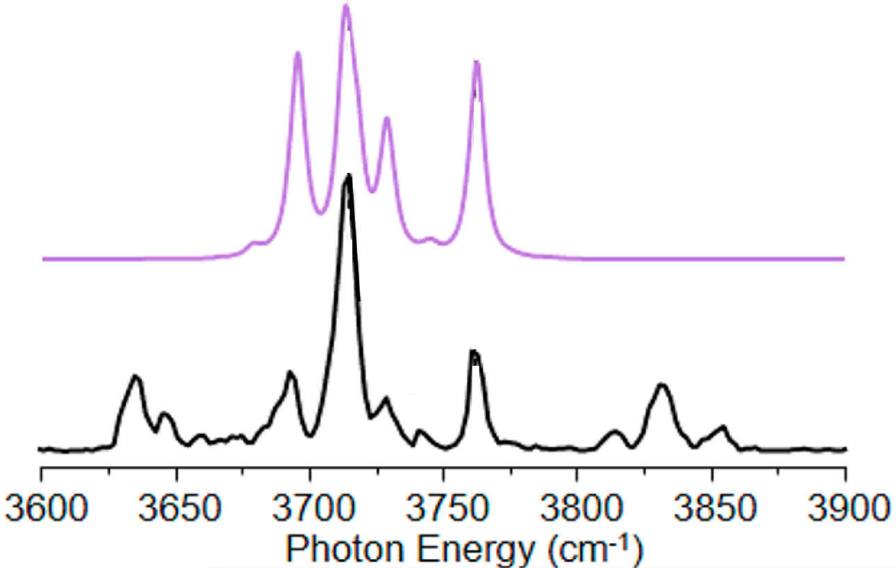

# Stick Spectra

When an experimentalist collects an infrared/vibrational spectrum, the signal they tend to get out generally looks something like this[1]

{:width="500px"}

We can see that there are well defined peaks or "features", which have a maximum at a given frequency, but these features also have a width to them. That width is a time-dependent, dynamical effect and goes beyond what we as a group generally are interested in.
So when we calculate a spectrum, we usually calculate a _stick spectrum_, which is a set of frequencies and associated intensities, that can be plotted like

{:width="500px"}

and then to make comparisons to experiment a bit cleaner, we'll choose a width, or amount of broadening, and multiply each intensity by a normal distribution with that width centered around its associated frequency. You will often hear this described as "convolving with a Gaussian".

At the end of the day, that means we end up with a spectrum that looks like

{:width="500px"}

or a bit cleaner for the purposes of comparison

{:width="500px"}

Got questions? Ask them on the [McCoy Group Stack Overflow](https://stackoverflow.com/c/mccoygroup/questions/ask)
{: .alert .alert-info}

---
1.  [https://pubs.acs.org/doi/10.1021](https://pubs.acs.org/doi/10.1021)

[1]: #fn1

[Edit on GitHub](https://github.com/McCoyGroup/References/edit/gh-pages/References/Spectrum%20Generation/BasisSetSpectra.md)