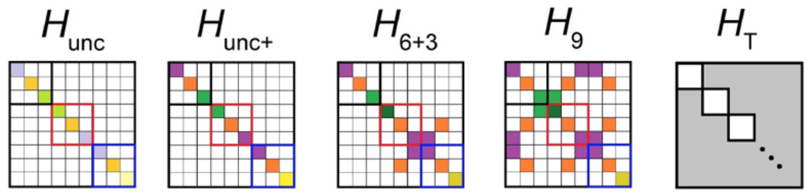
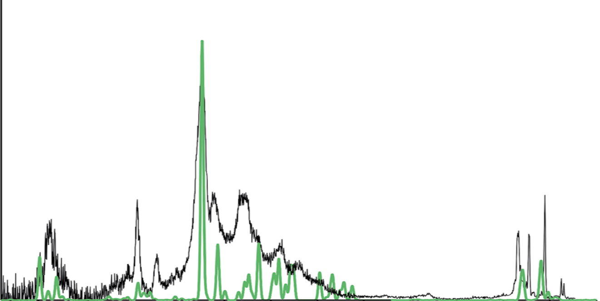

# References

This is the general list of references we've written up. 
More may come in the future in which case they will be linked to here.

## [Basis Set Methods](Basis%20Set%20Methods)
These are methods that give exact solutions to the Schrödinger equation based on a choice of basis [»](Basis%20Set%20Methods)
[{:width="500px"}](https://pubs.acs.org/doi/10.1021/acs.jpca.7b10784)

## [Monte Carlo Methods](Monte%20Carlo%20Methods)
... [»](Monte%20Carlo%20Methods)

## [Spectrum Generation](Spectrum%20Generation)
Methods for generating spectra to provide experimental validation of our theoretical results [»](Spectrum%20Generation)
[{:width="500px"}](https://pubs.rsc.org/en/content/articlelanding/2018/FD/C8FD00120K#!divAbstract)
  
---
[Edit on GitHub](https://github.com/McCoyGroup/References/edit/gh-pages/References/index.md)
