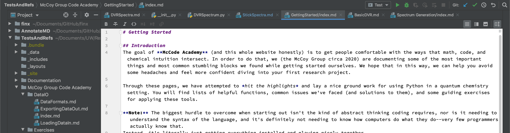
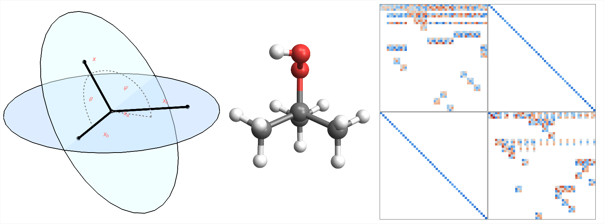

# Where am I?

This site's purpose is to provide resource and reference to the code and problems approached in the McCoy Group. It has been complied by group members for group members. With that, we make no promises that the reference pages or documentation is perfectly cohesive or that any code documented will run perfectly the first time, but it's a start.

---

### [McCode Academy](McCoy%20Group%20Code%20Academy)

This is the home page of our new McCode Academy.
This was written with the intention of getting people ready and thinking about the kinds of problems we approach.
It is written (hopefully) to compliment the references [»](McCoy%20Group%20Code%20Academy)

{:width="100%"}

### [References](References)

References written up to help explain topics that are common to our research [»](References)

{:width="100%"}

### [Contributing](Contributing.md)

If you are interested in contributing to this site, please read our contributing note [»](Contributing.md)  
If you are having issues with the site, please visit our issues page [»](https://github.com/McCoyGroup/References/issues)

### [Documentation](Documentation)

Documentation for some of the python projects that we work on. Primarily
 autogenerated from the docstrings provided. Some examples also provided.
For the most part, these docs are only as complete as the docstrings they come
 from, so essentially they're woefully incomplete.
*When combined with the unit tests provided [here](https://github.com/McCoyGroup/References/Tests)
they can be a powerful tool for figuring out how to use the code.*

A WORK IN PROGRESS. 
THIS IS YOUR PROCEED-WITH-CAUTION WARNING.
{: .alert .alert-danger}

---

### Not sure where to start?
Try this: [Introduction to Quantum Chemistry](https://mccoygroup.github.io/References/References/Intro%20To%20Quantum/)
or this: [Getting Started with McCode Academy](https://mccoygroup.github.io/References/McCoy%20Group%20Code%20Academy/GettingStarted/)
or ask someone!
